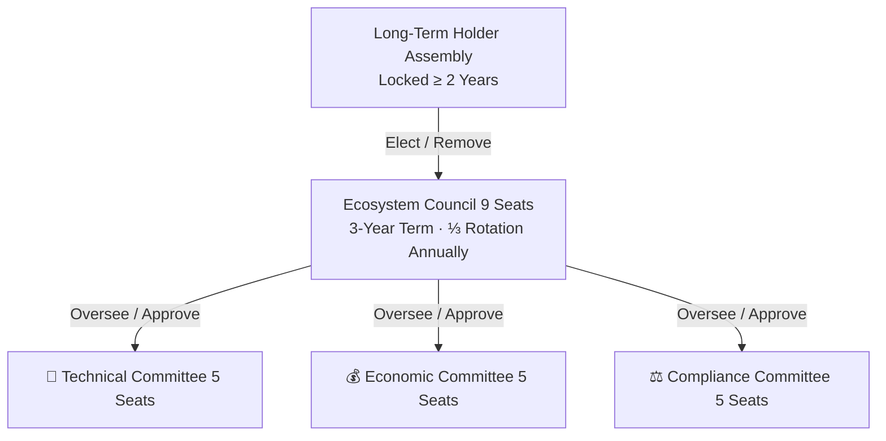
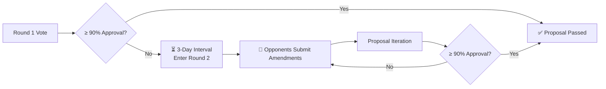

# Governance System

## Governance Philosophy

> Short-term holders optimize short-term interests; long-term holders optimize system value.

Governance power = **time-weighted**. The longer the lock-up, the greater the voting weight. Minimum 2-year lock required for governance participation.

## Voting Weight Formula

$$W_{vote} = K_{locked} \times \sqrt{T_{lock}}$$

| Variable | Meaning |
|------|------|
| $K_{locked}$ | Amount of KEY locked |
| $T_{lock}$ | Lock duration (years) |

The square root function ensures diminishing time-weighted returns, preventing indefinite lock-up monopolies.

## Governance Structure

## Current Council

Status: 9/9 seats filled ✅

| # | Role | Address |
|---|------|------|
| 1 | Deployer/Admin | [0x424f...25eA](https://etherscan.io/address/0x424f44a2Cb150cC23a0eB41Bc38Fd7b4D3ad25eA) |
| 2 | Oracle 1 | [0x9593...0aB6](https://etherscan.io/address/0x9593dDf6A0e84b1Fd1a8E7B0C3D5c9f2A4B10aB6) |
| 3 | Councilor | [0x90Be...4061](https://etherscan.io/address/0x90Be9A8b7C6d5E4f3a2B1cD0eF8A7b6C5dE44061) |
| 4 | Oracle 3 | [0xc105...6C86](https://etherscan.io/address/0xc105B1E8A9D7c6F5e4A3b2C1d0E9F8A7B6dC6C86) |
| 5 | Councilor | [0x5dD1...0c90](https://etherscan.io/address/0x5dD14d9C8B7A6e5F4B3C2D1E0F9a8B7C6d50c90) |
| 6 | Councilor | [0x033e...34aC](https://etherscan.io/address/0x033e7D6C5b4A3E2f1C0D9B8a7F6e5D4c3B2A34aC) |
| 7 | Councilor | [0x0673...A63a](https://etherscan.io/address/0x06735d4c3B2a1E0F9D8c7B6A5e4F3d2C1b0A63a) |
| 8 | Oracle 2 | [0x4Dd4...31AD](https://etherscan.io/address/0x4Dd4B2A1C0d9E8F7c6B5A4e3D2f1C0B9a831AD) |
| 9 | Test | [0xd8A1...47Da](https://etherscan.io/address/0xd8A1B9C8d7E6f5A4b3C2d1E0F9a8B7c6D5e47Da) |

## Voting Thresholds

| Matter | Participation Threshold | Approval Condition |
|------|-----------|---------|
| Oracle Whitelist Add/Remove | 10% Voting Power | 70% in favor |
| Contribution Weight Adjustment | 15% Voting Power | 75% in favor |
| Economic Multiplier $M$ Adjustment | 20% Voting Power | 80% in favor |
| Protocol Upgrade | 25% Voting Power | 85% in favor |
| Council Election | 15% Voting Power | Top N by votes elected |
| Emergency Pause | Council 5/9 | Auto-expires after 72h |

## Locking & Unlocking Mechanism

- **Standard Unlock**: Linear release over **12 months** after lock expiry
- **During Release**: Voting weight decreases proportionally with remaining locked amount
- **Early Unlock**: **20%** penalty (to ecosystem fund) + forfeits current voting rights

## 90-99% Approval Mechanism

The goal is not "majority overwhelms minority" but **iterating proposals until nearly everyone can accept them**.
