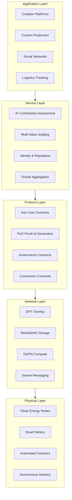
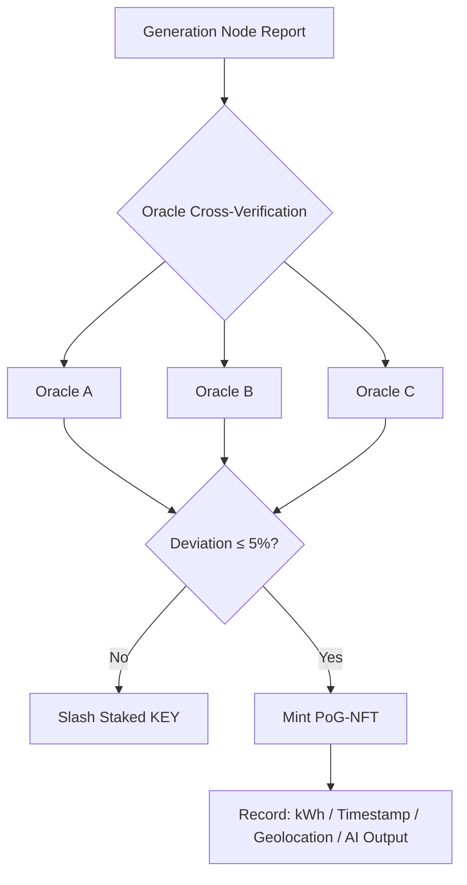
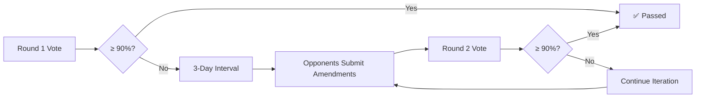
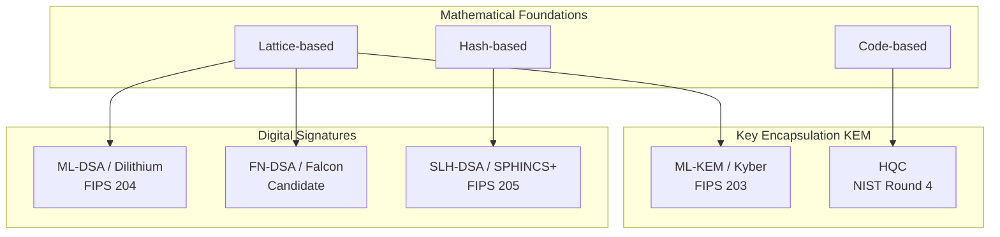
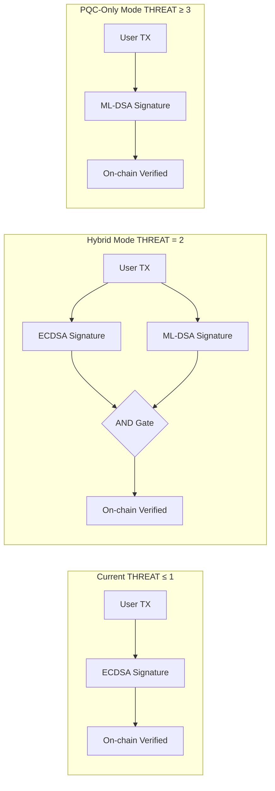
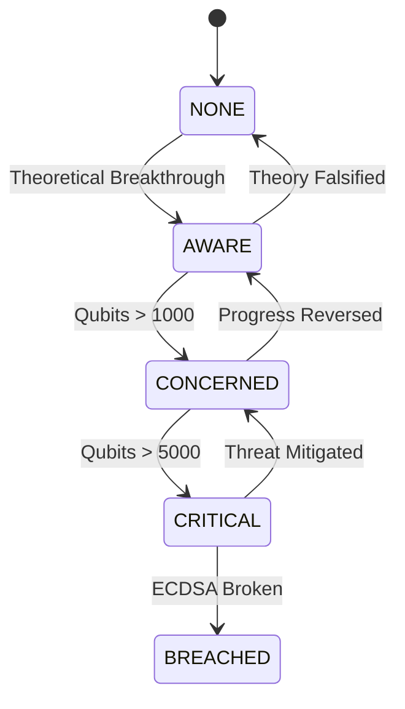
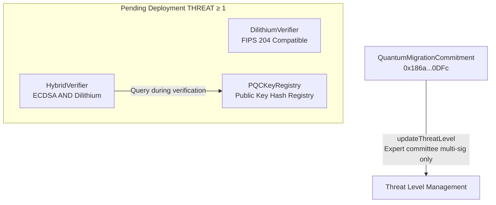

# Technical Architecture

## Seven-Layer Infrastructure Stack



| Layer | Responsibility |
|------|------|
| Physical | Clean energy nodes, smart meters, automated factories, autonomous delivery hardware |
| Network | Decentralized message routing, content-addressed storage, compute scheduling |
| Protocol | ERC20 token, PoG consensus, governance voting, cross-chain conversion |
| Service | AI contribution quantification, value assessment, identity management, data aggregation |
| Application | User-facing creation, production, social, and logistics tools |

## Proof-of-Generation (PoG)

Unlike PoW/PoS traditional mining. **Generation is proof.**



- **≥3 independent Oracles** cross-verify
- Deviation > 5%: slashing of staked Key Coin
- Upon verification: PoG-NFT minted, recording kWh, timestamp, geolocation, AI output

## AI Contribution Assessment

**Core Formula:**

$$V^t = \sum_{i} w_i \times (e_i^t \times c_i^t)$$

| Dimension $(i)$ | Meaning | Example Weight |
|-----------|------|---------|
| 1 | Power contribution | Base weight, non-forgeable |
| 2 | Original design | AI computes semantic distance |
| 3 | Community interaction | Deep engagement weighted > shallow likes |
| 4 | Iterative optimization | Incremental contribution from derivative works |

## 90-99% Approval Mechanism

Multi-round voting → proposal iteration → converging toward consensus. Eliminates 51% tyranny-of-the-majority.



## Contract Architecture

| Contract | Address | Function | Verified |
|------|------|------|:--:|
| KeyCoinAnchor | [0xf2ad...4138](https://etherscan.io/address/0xf2ad88977E8A687b9EE5c7636e0aC4eBBDcC4138) | ERC20 + Minting | ✅ |
| KeyCoinLocking | [0x2c5b...291f](https://etherscan.io/address/0x2c5b6E7Ccf2ebDfA4d3c4E7f9Ad2B1AbeE1291f) | Lock-up + Time-Weighted Voting | ✅ |
| KeyCoinGovernor | [0x87a0...6f91](https://etherscan.io/address/0x87a0d4C8B9e6F3A2b1D5c7E9fA0B3C6d2E8f46f91) | Council + Proposals | ✅ |
| QuantumMigrationCommitment | [0x186a...0DFc](https://etherscan.io/address/0x186a31AAF4e025a3475A7977005504E7AdCE0DFc) | Quantum Safety Commitment | ✅ |

---

<a name="pqc"></a>

# Post-Quantum Cryptography (PQC) Technical Architecture

> Key Coin solemnly commits: complete network-wide PQC migration before quantum computers pose a material threat to ECDSA. This commitment is irrevocable and enshrined in the QuantumMigrationCommitment contract.

## Threat Model

Quantum computers threaten blockchains from three directions:

### Shor's Algorithm — The Asymmetric Crypto Terminator

Shor's algorithm breaks the mathematical foundations of RSA and ECDSA in polynomial time. Ethereum's secp256k1 curve is defenseless against a sufficiently fault-tolerant quantum computer.

$$N = p \times q \quad\rightarrow\quad f(x) = a^x \bmod N \quad\rightarrow\quad \text{QFT finds period } r \quad\rightarrow\quad p,q = \gcd(a^{r/2} \pm 1, N)$$

### Grover's Algorithm — The Symmetric Crypto Weakening

Grover's algorithm reduces brute-force search complexity from $O(N)$ to $O(\sqrt{N})$. Keccak-256's preimage resistance drops from 256-bit to 128-bit. Countermeasure: extend hash output to 384-bit or use SHAKE-256 directly.

### HNDL (Harvest Now, Decrypt Later) — The Most Urgent Threat

Attackers intercept and store encrypted transaction data today, decrypting it once quantum computers mature. Even if quantum computers are 5-10 years away, data requiring long-term confidentiality is already at risk.

## NIST Standardization Landscape

NIST launched the global PQC algorithm competition in 2016. On August 13, 2024, the first three FIPS standards were officially published:

| FIPS Standard | Algorithm Name | Math Basis | Purpose | NIST Security Level |
|-----------|---------|---------|------|:--:|
| FIPS 203 | ML-KEM (CRYSTALS-Kyber) | Lattice (Module-LWE) | Key Encapsulation (KEM) | 1 / 3 / 5 |
| FIPS 204 | ML-DSA (CRYSTALS-Dilithium) | Lattice (MLWE/MSIS) | Digital Signature | 2 / 3 / 5 |
| FIPS 205 | SLH-DSA (SPHINCS+) | Hash Functions | Digital Signature (Backup) | 1 / 3 / 5 |

In March 2025, NIST selected the code-based algorithm HQC for additional KEM standardization, achieving a "lattice + code + hash" triangulation.

### Global Migration Timeline Consensus

| Timeline | Event | Source |
|----------|------|------|
| 2025 | Software/firmware signing, browsers/servers → PQC default | NSA CNSA 2.0 |
| 2027 | Operating systems → PQC default | NSA CNSA 2.0 |
| 2028 | Organizations complete crypto asset discovery, formulate migration plans | NCSC |
| 2030 | Deprecate ≤112-bit classical asymmetric algorithms (incl. RSA-2048) | NIST IR 8547 |
| 2031 | High-priority systems complete PQC migration | NCSC |
| 2035 | Full ban on classical asymmetric crypto, PQC migration complete | NIST + NCSC + EU |

## Algorithm Families



### Lattice-Based — The Workhorse

Security relies on SVP (Shortest Vector Problem) and CVP (Closest Vector Problem) in high-dimensional lattices, both NP-hard.

**ML-KEM (Kyber) — Key Encapsulation**

Built on the Module-LWE problem. Intuition: given many "noisy" linear equations $A \cdot s + e = b$, recovering the secret vector $s$ from $b$ is hard in both classical and quantum settings.

Process:
1. **Key Generation**: random matrix $A$ + small secret vector $s$ → public key $(A, t = A \cdot s + e)$
2. **Encapsulation**: encrypt with $r$ → ciphertext $(u, v)$ → derive shared key
3. **Decapsulation**: recover shared key from ciphertext using $s$ (leverages bounded error correction)

Performance benchmark: 6000 encapsulations/sec, 3500 key pairs/sec.

**ML-DSA (Dilithium) — Digital Signature**

Adopts the Fiat-Shamir with Aborts paradigm. If the response vector $z$ coefficient is too large during signing, "abort" and retry, preventing secret vector distribution leakage.

Key feature: supports batch signature verification — in "single key + multiple messages" scenarios, 20%-50% faster than per-message verification.

Performance benchmark: 1000 signatures/sec, 3000 verifications/sec.

### Hash-Based — The Conservative Backup

SLH-DSA (SPHINCS+) depends only on hash function collision resistance, making it the most conservative security assumption.

Structure: WOTS+ one-time signatures → Merkle Tree aggregation → Hypertree multi-layer nesting.

Trade-off: signature size 8-50 KB (vs ECDSA's 64 bytes, Dilithium's ~2.4 KB), signing speed 1-2 orders of magnitude slower. Used only as backup in high-frequency TLS handshakes.

### Code-Based — Diversity Assurance

HQC is based on the syndrome decoding problem (NP-complete), having withstood 40+ years of cryptanalysis since the original McEliece scheme in 1978. NIST selected it as Kyber's "mathematically distinct" backup — should a theoretical breakthrough compromise lattice-based cryptography, HQC provides an escape path.

## Key Coin PQC Migration Architecture

### Hybrid Signature Mode — The Transition Core

Key Coin employs **Hybrid AND mode** (not OR):

$$\text{Valid Signature} = \text{ECDSA}(secp256k1) \text{ verifies } \mathbf{AND} \text{ ML-DSA}(Dilithium) \text{ verifies}$$

Not "either/or" — both must pass to be valid. Prevents attackers from downgrading to ECDSA-only weak mode.



### Crypto-Agility Design

Core principle: algorithm selection decoupled from business logic. Never hard-code algorithms in contracts.

```solidity
// ❌ Hard-coded — unacceptable
require(ecrecover(hash, v, r, s) == signer, "invalid")
```

```solidity
// ✅ Crypto-agile — upgradeable
interface ISignatureVerifier {
    function verify(bytes32 hash, bytes calldata signature, address claimedSigner)
        external view returns (bool);
}
```

Verifier contracts are pluggable: `ECDSAVerifier` → `HybridVerifier` → `DilithiumVerifier`, with zero changes to business contracts.

## Five-Tier Threat Response Mechanism

| Tier | Name | Trigger Condition | System Behavior | User Action |
|:--:|------|---------|---------|---------|
| 0 | NONE | Current state | Normal operation, PQC libraries continuously integrated on testnet | None required |
| 1 | AWARE | Quantum computing theoretical breakthrough (Shor's algorithm experimentally verified ≥ 10 qubits) | Deploy Dilithium verifier on testnet, open PQC key registration | Optional: generate PQC key pair early |
| 2 | CONCERNED | Logical qubits > 1000 or equivalent fault-tolerant qubits > 100 | Hybrid signature mode live, ECDSA + ML-DSA dual verification | Recommended: register PQC public key hash |
| 3 | CRITICAL | Quantum computer approaching 256-bit ECDSA break (estimated ≥ 5000 logical qubits) | Auto-freeze non-PQC high-value TX (>100K KEY), 90-day migration deadline | Required: complete PQC key registration |
| 4 | BREACHED | ECDSA actually broken | Only PQC signatures valid, non-PQC TX permanently rejected | Non-PQC addresses frozen, recovery via governance proposal |

### Escalation Flow



Each tier change requires:
1. ≥ 3 quantum security expert committee members' multi-sig confirmation
2. IPFS evidence link attached (academic papers, NIST bulletins, industry reports)
3. On-chain event permanently recorded

## Key & Signature Size Comparison

| Algorithm | Public Key | Private Key | Signature/Ciphertext | Security Level |
|------|------|------|----------|:--:|
| ECDSA (secp256k1) | 33 B | 32 B | 64 B | Classical 128-bit |
| ML-DSA (Dilithium) | 1.3 KB | 2.5 KB | 2.4 KB | NIST L2 (128-bit PQ) |
| ML-DSA (Dilithium-5) | 2.6 KB | 4.9 KB | 4.6 KB | NIST L5 (256-bit PQ) |
| SLH-DSA (SPHINCS+-128s) | 32 B | 64 B | 7.9 KB | NIST L1 |
| FN-DSA (Falcon-1024) | 1.8 KB | 2.3 KB | 1.3 KB | NIST L5 |
| ML-KEM (Kyber-768) | 1.2 KB | 2.4 KB | 1.1 KB (ciphertext) | NIST L3 |

## Side-Channel Attacks & Fault Injection Defense

Mathematical security of PQC algorithms ≠ physical implementation security. High-performance implementations (e.g., NTT number theoretic transform) may leak secrets through power consumption, timing, or electromagnetic radiation.

### Known Attack Vectors

| Attack Type | Target | Method | Consequence |
|---------|------|------|------|
| Differential Power Analysis (DPA) | Kyber / Dilithium | Collect tens of thousands of power traces, statistical analysis | Recover secret polynomials |
| Template Attacks | Lattice implementations | Profile known-key device → attack unknown device | Recover full private key |
| Fault Injection (FI) | Dilithium abort check | Skip loop check → collect faulty signatures | Few faulty signatures recover private key |
| Timing Attacks | "Constant-time" implementations | Exploit compiler optimization / CPU microarchitecture differences | Leak secret bits |

### Key Coin Defense Strategy

| Layer | Countermeasure |
|------|------|
| Software | Strict constant-time coding, masking + shuffling dual protection |
| Hardware | Execute signing inside HSM/TPM, physically isolate keys, built-in side-channel mitigation |
| Protocol | Hybrid AND mode: even if PQC implementation has flaws, ECDSA side still provides protection |
| Governance | Expert committee continuously monitors PQC implementation security advisories, emergency contract upgrades when needed |

## User Migration Flow

```
THREAT = 0-1 (Current): Normal ECDSA usage, no action required
    ↓
THREAT = 2 (CONCERNED): Generate Dilithium key pair → register PQC public key hash on-chain → system auto-enables hybrid signing, zero friction
    ↓
THREAT = 3 (CRITICAL): 90-day countdown begins, all high-value TX must use hybrid signing, non-migrated → frozen
```

**PQC Public Key Registration TX:** `registerPQCKey(bytes32 pqcPubKeyHash)`

- Only submit public key hash (32 bytes), minimal on-chain storage overhead
- After registration, address binds both ECDSA public key (implicit, i.e., address) and PQC public key hash
- Updatable (72-hour timelock to prevent hijacking)

## On-Chain Contract Architecture



**QuantumMigrationCommitment Core Interface:**

```solidity
interface IQuantumMigrationCommitment {
    function currentThreatLevel() external view returns (uint8);
    function upgradeThreatLevel(uint8 newLevel, string calldata evidenceIPFS) external;
    function migrationDeadline() external view returns (uint256);
    function registerPQCKey(bytes32 pqcPubKeyHash) external;
    function pqcKeyRegistered(address user) external view returns (bool, bytes32);
    function verifyHybrid(bytes32 hash, bytes calldata ecdsaSig, bytes calldata pqcSig, address claimedSigner) external view returns (bool);
}
```

Current on-chain data: threat level = **2 (CONCERNED)** ✅

## Global Standards Alignment

| Key Coin PQC Architecture | NIST / Global Standard | Status |
|-------------------|--------------|:--:|
| ML-DSA (Dilithium) | FIPS 204 | ✅ |
| ML-KEM (Kyber) | FIPS 203 | ✅ |
| SLH-DSA (SPHINCS+) | FIPS 205 | ✅ |
| HQC | NIST Round 4 | ✅ Monitoring |
| 2035 Full Migration | NIST IR 8547 / NCSC | ✅ |
| Hybrid AND Mode | NIST Whitepaper Recommended | ✅ |
| Crypto-Agility | NIST Crypto-Agility Principles | ✅ |
