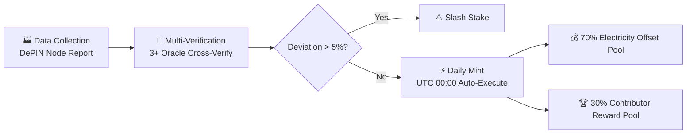
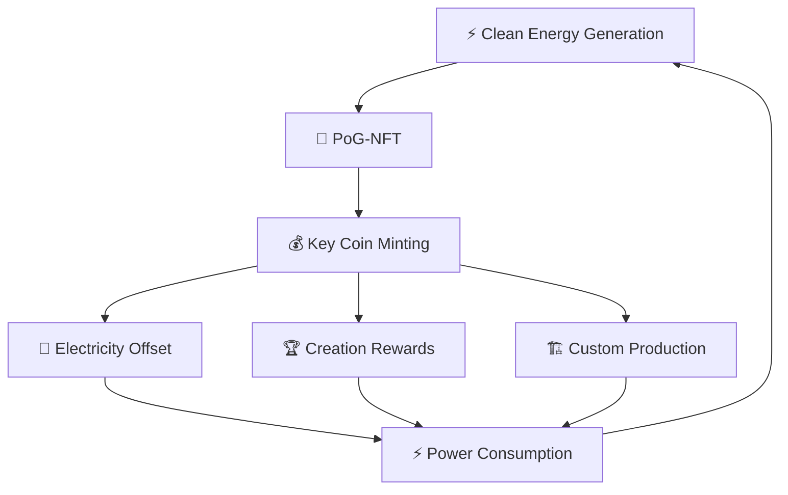

# Key Coin Tokenomics

1:1 pegged to daily power generation — generalized currency

## Pegging Formula

$$M = 1 + \frac{V_{AI}}{C_{power}}$$

| Variable | Meaning |
|------|------|
| $M$ | Economic value multiplier |
| $V_{AI}$ | Daily AI compute network economic value (USD) |
| $C_{power}$ | Total daily power generation cost |

**Example:** If daily generation is 1 billion kWh and AI output value is 0.3× generation cost → $M = 1.3$ → 1.3 billion KEY minted that day.

## Issuance Process — Proof-of-Generation

## Circulation Loop

## Token Distribution

| Category | Share | Description |
|------|------|------|
| Direct Electricity Offset | **70%** | Auto-deducted for users/nodes, covering ~70% of AI compute costs |
| Contributor Reward Pool | **30%** | AI-assessed distribution to creators and community participants |

### Ecosystem Development Fund (20% of total supply)

| Sub-fund | Share of Fund | Purpose |
|------|---------|------|
| Creator Fund | 35% | Artists, designers, content producers |
| Developer Fund | 25% | Protocol contributors, DApp developers |
| Clean Energy Fund | 20% | Clean energy node deployment subsidies |
| Education Fund | 12% | Universal basic education content |
| Community Fund | 8% | Community organizers, translators, evangelists |

## Inflation Control

<h3>⚡ Real Generation Hard Cap</h3>

Daily issuance strictly constrained by verified generation data. Physical laws guarantee monetary discipline.

<h3>🔥 Auto-Burn Mechanism</h3>

Key Coin partially burned during electricity offset, naturally reducing circulating supply and maintaining long-term scarcity.

<h3>🔒 Long-Term Locking Reduces Circulation</h3>

Governance voting requires 2+ year lock-up, pulling large amounts of KEY out of circulation and lowering inflation pressure.

## On-Chain Data

| Metric | Value |
|------|-----|
| Total Supply | ~21,474,836 KEY |
| Base Multiplier | 1.0 |
| Last Mint Day | Day 20582 |
| Locked KEY | 100 KEY (Test) |

## Quantum Safety Commitment

On-chain [QuantumMigrationCommitment](https://etherscan.io/address/0x186a31AAF4e025a3475A7977005504E7AdCE0DFc) (`0x186a...0DFc`), with a five-tier threat response mechanism ensuring asset safety in the quantum era.

> See [Technical Architecture](/en/tech.html) — Quantum Security Architecture section.
