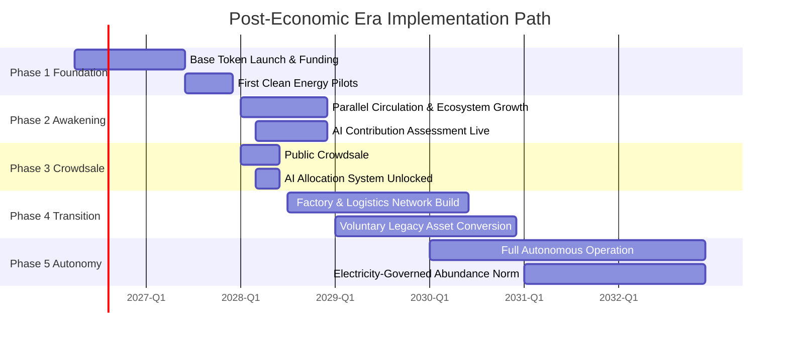
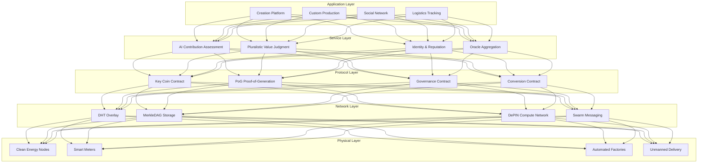
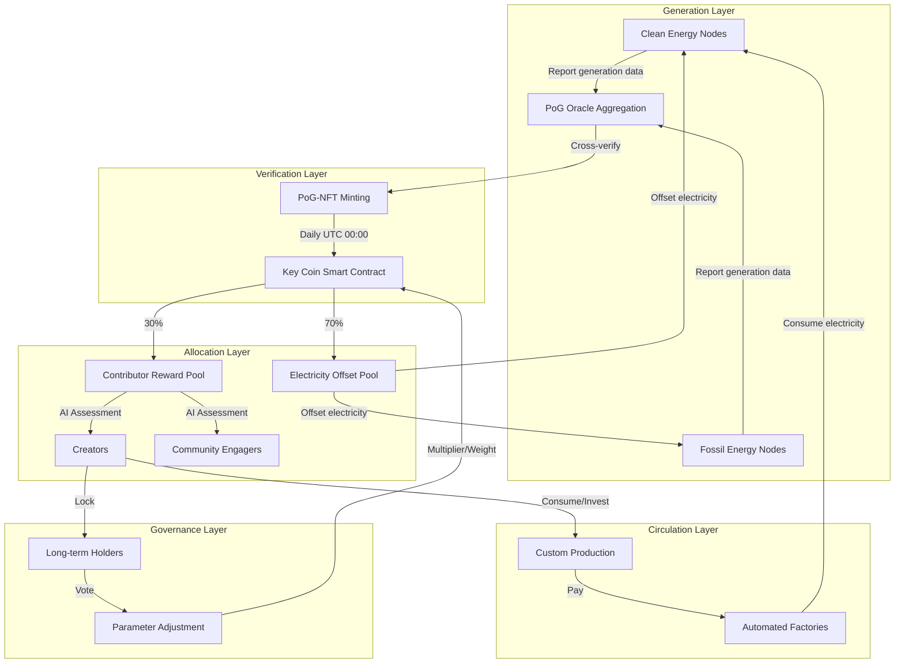
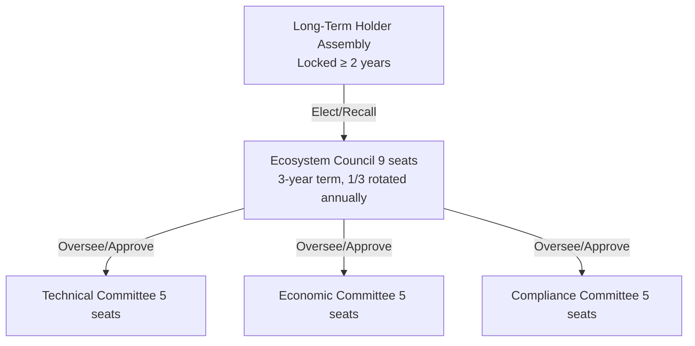
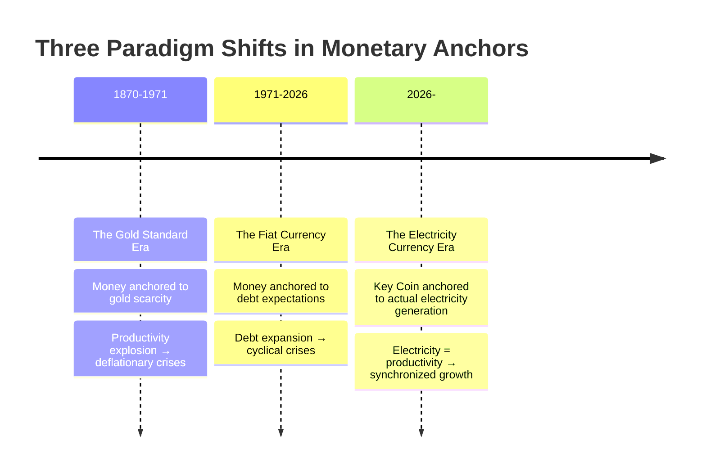
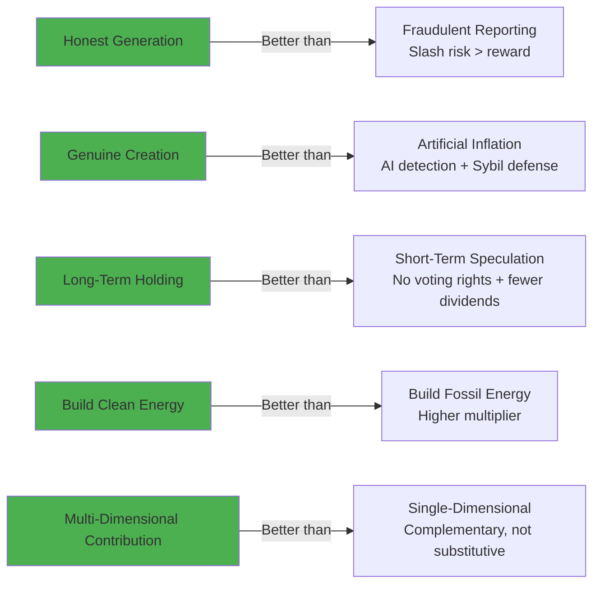

```markdown
# The Post-Economic Era: A Whitepaper on an Electricity-Driven AI Abundance Economy

**Version:** 1.0
**Authors:** [Jorcy_L2e / XACGteam]
**Date:** April 2026
**Target Audience:** Investors, technologists, the younger generation, policy observers, energy and creation ecosystem participants

---

## Executive Summary

In February 2026, Citrini Research published a thought-experiment report titled *The 2028 Global Intelligence Crisis*, and it landed like a fire bell in the night: the large-scale displacement of white-collar workers by AI agents could trigger "phantom GDP" (soaring output alongside collapsing consumption), the unraveling of commercial intermediation, a chain of financial defaults, and ultimately a 10.2% unemployment rate with the S&P 500 retreating sharply from its 2026 peak. Though mainstream institutions dismissed the report as "science fiction," it laid bare with surgical precision the fragility of the traditional "labor–consumption–finance" cycle in the age of AI. Modern finance has already run through the "borrow first, crisis later" loop three times; China has experienced it only once, in 2008—meaning the next shock will be far more violent, and the human cost far more direct.

**This whitepaper proposes a reconstruction plan**: not to rescue the old system, but to execute a soft landing into the **Post-Economic Era**. The core mechanism is **Key Coin**—a broad money supply anchored 1:1 to daily actual electricity generation (not annual GDP), capable of directly offsetting electricity bills (covering approximately 70% of AI compute's core cost). Combined with an AI compute network (72% of economic value anchored to electricity; the remaining 28% in manufacturing hardware covered by network premiums), it drives the expansion of clean energy, universal foundational education, and an age of creation—ultimately arriving at a world where "electricity governs human society."

**Key data points** (latest 2026 reports):
- **Goldman Sachs Research**: Global data center power demand will grow 220% by 2030 relative to 2023, with the United States contributing roughly 60%.
- **IEA *Electricity 2026***: Global electricity demand will grow at an annual average of 3.6%–3.7% from 2026 to 2030, with AI and data centers as the primary drivers; electricity is growing more than twice as fast as overall energy demand.
- **DePIN sector**: As of March 2026, over 650 active projects, with AI compute and energy DePIN growing rapidly—offering mature templates for distributed infrastructure.

**The benefits**: Achieving even 30% of the vision will dramatically improve daily life. Young people can do what they love and earn Key Coin, or choose a baseline guarantee and "opt out" of the rat race. The old debt-crisis cycle is broken; society returns to pluralistic, neutral value judgments (pursuing 90–99% approval rather than a mere 51% majority).

**Call to action**: In Q2 2026, the Key Coin base token will officially launch and funding will commence. We invite global investors, technologists, creators, energy enterprises, and ordinary users alike to join us in building this ecosystem—your participation will directly shape the Post-Economic Era.

---

## Foreword: Building the Post-Economic Era

Imagine Xiao Li in 2028, an ordinary young designer. He wakes up in the morning without a thought for his electricity bill—his Key Coin account receives a baseline allocation automatically each day, enough for a dignified life. He's passionate about music; last night he uploaded an AI-assisted composition to the decentralized network. Minutes later, the AI system (running on a full high-performance algorithm) renders a neutral judgment on his contribution value, and additional Key Coin arrives in his account.

He needs a personalized phone: no camera, just extreme thinness and lightness. He submits the design on the platform; the AI immediately orchestrates the automated cross-industry integrated factory. Using only a small amount of Key Coin, his custom product is delivered days later via the automated logistics system. No middleman markup, no brand captivity—everything is efficient and fair.

Meanwhile, the old world struggles under the shadow of the Citrini report: white-collar unemployment drives up the savings rate, consumption collapses, private credit defaults ripple into pension funds. But Xiao Li's world is different: electricity is no longer a cost but a currency; AI is not a butcher but an assistant; value is measured neutrally by a pluralistic system (90–99% approval).

**This is the Post-Economic Era**: we do not wait for the crisis—we build the bridge now. Key Coin + the AI compute network makes production abundant, distribution fair, and humanity free to focus on creation and meaning. The Citrini five-ring collapse chain is replaced by a "braking mechanism": electricity incentivizes building more power, AI assists creation, universal foundational education empowers capability.

**The urgency in numbers**:
- Data center power demand is surging (Goldman Sachs 220% growth forecast).
- The IEA confirms AI and data centers are driving strong global electricity demand growth.

Our narrative: pivoting from the fear of an "AI slaughterhouse" to the breathtaking vision of "electricity abundance + universal creation." People are drawn by both interest (Key Coin offsets costs, creation generates income) and beauty (doing what one loves, living with dignity).

Decentralization is the Post-Economic Era in its natural form.

---

## 0. The Three Forms of Debt: An Evolutionary History of Monetary Anchors

### 0.1 The Chains of Gold (1870–1971)

In the 1870s, the world's major economies embraced the gold standard one after another. Every banknote in circulation could be redeemed at a fixed rate for gold dug out of the earth's crust.

The implicit logic of this system was: **the boundary of human productive capacity is delimited by the natural scarcity of a metal.** Gold supply grew by roughly 1.5%–2% annually, and the global economy was "permitted" to grow at that same pace. When the productivity explosion of the Industrial Revolution outpaced gold supply, the result was not prosperity but *deflation*—more goods, unchanged money supply, falling prices, and a rising real burden of debt.

The Panic of 1893, the Bankers' Panic of 1907, the Great Depression of the 1930s—beneath every crisis lay the same script: **the creative force of the real economy was suffocated by the physical scarcity of its monetary anchor.**

In 1944, the Bretton Woods system attempted a fix: the dollar pegged to gold ($35/oz), and all other currencies pegged to the dollar. This "gold–dollar dual anchor" held for 27 years. On August 15, 1971, Nixon closed the gold window—not because America *chose* to abandon the gold standard, but because the gold standard could no longer accommodate the postwar volume of global trade and productivity.

The moment the golden chains snapped, the human economy entered an experiment without precedent.

### 0.2 The Spiral of Debt (1971–2026)

After the dollar's decoupling from gold, the world entered the era of **pure fiat currency**. Money was no longer backed by metal, but by "the expectation of future tax revenue"—that is, by debt.

This brought astonishing growth, and astonishing fragility. Below are the three complete debt cycles the modern financial system has endured:

| Crisis | Trigger | Response | Who Paid |
|--------|---------|----------|----------|
| 2000 Dot-Com Bubble | Excessive equity expansion | Rate cuts → real estate inflation | Retail investors |
| 2008 Global Financial Crisis | Runaway mortgage securitization | QE + government bailouts | Taxpayers worldwide |
| 2026 (Citrini warning) | AI replaces white-collar → consumption collapse → credit default | ? | ? |

**The pattern is clear**: after each crisis, the system is not repaired—it is patched with an even larger expansion of debt that postpones the reckoning. Global debt ballooned from roughly $80 trillion in 2000 to roughly $315 trillion in 2025. Behind every dollar of GDP stands more than three dollars of debt.

Particularly concerning is **China's position**. China has fully experienced only one global debt-crisis shock—2008—absorbed through a ¥4 trillion stimulus and real estate expansion. This means that when the next shock arrives, the buffer mechanisms and experience reserves are far thinner than in Western systems that have endured three full cycles. The human cost will be far more immediate.

### 0.3 The Awakening of Electricity (2026– )

Citrini Research's *The 2028 Global Intelligence Crisis* is important not because its predictions are precise, but because it reveals a **structural fracture**:

The implicit premise of the traditional "labor–consumption–finance" cycle is that **human beings are the unified subject of both production and consumption.** You work, earn income, spend that income on consumption, consumption drives production, and production needs your labor. This closed loop has functioned for two centuries.

AI shatters this unity. AI can produce (its output counts toward GDP), but AI does not consume. When AI displaces white-collar workers at scale—not blue-collar manual labor, but analysts, programmers, designers, paralegals—GDP continues to grow (AI output), but consumption collapses (displaced people stop consuming).

This is what Citrini calls "phantom GDP": **the unified subject of production and consumption has been torn apart.**

This is not a cyclical crisis. This is a **structural break in the cycle**. Rate cuts, QE, fiscal stimulus—the entire traditional toolkit addresses "insufficient demand," but this time the problem is "the *subject* of demand has disappeared."

### 0.4 Key Coin's Historical Position

Returning to the evolutionary logic of monetary anchors:

| System | Anchor | Constraint Type | Core Contradiction |
|--------|--------|-----------------|---------------------|
| Gold Standard | Metal scarcity | Physical constraint | Productivity outpaces anchor → deflation → crisis |
| Fiat Currency | Debt expectations | Temporal constraint | Debt growth outpaces productivity → leverage → crisis → more debt |
| **Key Coin** | **Actual electricity generation** | **Energy constraint** | Electricity = real-time expression of real productivity |

The problem with gold anchoring: productivity outpaces the anchor → deflation → crisis.
The problem with debt anchoring: debt growth outpaces productivity → leverage → crisis → more debt.
The logic of electricity anchoring: **every kilowatt-hour is an instantaneous expression of real productivity.** AI compute consumes electricity. Industrial production consumes electricity. Logistics and transport consume electricity. Electricity is the only universal measure of value that spans both the digital and physical worlds.

When Key Coin is anchored 1:1 to daily electricity generation:
- Generation growth = real productivity growth = money supply growth → **no deflation**
- Generation cannot inflate independently of physical infrastructure → **no hyperinflation**
- AI compute consumes electricity → AI "production" automatically generates monetary demand → **phantom GDP is eliminated**

This is Key Coin's place in the history of monetary evolution: **not another cryptocurrency, but a paradigm shift in the monetary anchor—from "scarcity" (gold) to "debt expectations" (fiat) to "energy flow" (electricity).**

### 0.5 The Soft Landing: The Bridge Mission of the Post-Economic Era

We harbor no illusion of replacing the existing financial system overnight. That would be a catastrophic hard landing.

The Post-Economic Era is **the intermediate vehicle for a soft landing**:
- **Phases 1–2**: Key Coin circulates in parallel with traditional currency, first establishing a closed loop in the vertical energy + compute scenario.
- **Phases 3–4**: Network effects take hold, voluntary conversion mechanisms activate, and legacy financial assets are mapped into the new system in an orderly fashion.
- **Phase 5**: When coverage reaches critical mass, "debt" no longer drives social operations—because the production–consumption cycle has been re-closed through the electricity anchor.

This is not a utopia. This is an engineering problem.

---

## 1. What Is the Post-Economic Era?

The Post-Economic Era is a decentralized abundance protocol built on blockchain and AI compute networks. Its objective is to construct a global economic system governed by electricity, through Key Coin anchoring and distributed AI technology. This protocol enables every user to freely create, store, and own contribution data, and—through decentralized autonomous governance—to determine the distribution, incentivization, and sharing of value via Key Coin issuance, circulation, and exchange, empowering content and creators, and forming a decentralized abundance-creation ecosystem.

The Post-Economic Era combines the dual strengths of value networks and AI productivity, placing the prosperity of the protocol ecosystem above all else. In any community, economy, or free market, an incentive system that fairly and accurately reflects participant contributions is the cornerstone upon which the community stands. The Post-Economic Era will, for the first time, use Key Coin to attempt the accurate and transparent measurement and incentivization of ecosystem participants and contributors, empowering universal creation.

| Dimension | Old Economy (Labor–Consumption–Finance Cycle) | Post-Economic Era (Electricity–Creation–Distribution Cycle) |
|-----------|-----------------------------------------------|------------------------------------------------------------|
| **Value Anchor** | Debt expectations (fiat) | Daily actual electricity generation (Key Coin) |
| **Production Driver** | Capital employs labor | AI + Electricity + Human creativity |
| **Distribution Logic** | Wage system (labor-time pricing) | Contribution system (multi-dimensional electricity + creativity assessment) |
| **Data Ownership** | Platform-owned | Fully user-owned |
| **Governance Model** | Shareholder voting (51% rule) | Long-term holder governance (90–99% approval) |
| **Role of Energy** | Cost item | The currency itself |

---

## 2. The Values of the Post-Economic Era

From the outset of designing the Post-Economic Era, the following core values have been consistently upheld:

1. **Producers of data and contributions (users) shall hold fundamental ownership over their contributions.** The economic system should exist in a decentralized form. This logic, articulated at the birth of the Post-Economic Era, is the founding intent of electricity abundance.

2. **Everyone who contributes to the Post-Economic Era ecosystem shall receive proportional rewards according to the rules.** The greatest advantage of the value network lies in its ability to assetize every drop of electricity within the creation and AI network.

3. **All forms of contribution shall carry equal weight in quantitative valuation.** For example, the time a participant invests, the outstanding works they produce, and the attention they contribute are, in essence, of equal measurable value to providing compute power.

4. **The fundamental purpose of the Post-Economic Era is to serve the public.** It is an ecosystem operated by a non-profit foundation, whose goal is to create and serve a global public that enjoys abundant creation—not to generate profit. All participants in the Post-Economic Era will benefit from the prosperity of the ecosystem itself.

5. **Creation should originate from people, not capital. Capital should serve to reward people, not to control them.** For instance, the core driving force of AI productivity should be the pursuit of quality in creation itself; demand should come from creators and designers, not from capitalists who themselves do not create.

---

## 3. Infrastructure Provided by the Post-Economic Era

The Post-Economic Era is not a single product, but a **vertically integrated, decentralized infrastructure stack**. Each of the seven layers is independent and replaceable, yet when they operate in concert they form a complete closed loop from electricity production to personalized consumption.

### 3.1 A Content and Product Platform for High-Quality Creation

A censorship-resistant, decentralized creation layer. What users upload is not merely "content"—design blueprints, musical works, software code, hardware specifications, manufacturing instructions—all are treated as **ownable creative assets**. The platform layer provides:
- Permanent storage based on IPFS + Filecoin
- Automatic on-chain registration of creation fingerprints (Content Hash)
- AI-assisted creation tool interfaces (text-to-image, code generation, design optimization)

Distinct from Web2 platforms: no algorithmic recommendation manipulation, no advertising auction rankings, no platform commission. Users see **what they want to see**, not what the platform wants them to see.

### 3.2 An AI Social and Contribution Network Connecting Everyone

This is not another social app. It is a **contribution relationship graph** built on a DHT overlay network:
- Each user holds a unique identity NFT (Soulbound)
- Follow relationships = contribution subscriptions; new works are pushed in real time via Swarm mechanisms
- AI agents build a three-dimensional "interest–skill–contribution" profile for each user, used for precision matching and collaboration
- Encrypted DM and mention mechanisms ensure private communication

### 3.3 The Bridge Electricity Currency — Key Coin

Anchored 1:1 to daily electricity generation with an AI economic value multiplier. Detailed in Chapter 8.

### 3.4 Payment and Distribution Network

An instant settlement layer based on smart contracts:
- Zero-gas Key Coin transfers (via Layer 2 batch processing)
- Full automation of contribution assessment → reward distribution
- Streaming Payment support: continuous rewards distributed by the second
- API integration with power grids and energy enterprises for direct electricity bill offset

### 3.5 Ecosystem Autonomy System

Users who hold Key Coin long-term form the governance body. Detailed in Chapter 9.

### 3.6 Automated Cross-Industry Integrated Factory

An AI-driven, end-to-end customized production network with these core features:
- **Design equals production**: user submits design file → AI parses manufacturing instructions → automatically matches the nearest factory → schedules production
- **Zero minimum order quantity**: the cost curves for single-unit customization and mass production of millions converge (AI-optimized scheduling + 3D printing / flexible production lines)
- **Full-process transparency**: every production step is recorded on-chain; users track in real time

Current technical foundation: Industry 4.0 digital twins, collaborative robots, and additive manufacturing have already moved from the lab to the factory floor. What the Post-Economic Era does is **use Key Coin incentives to weave them into a network**.

### 3.7 Automated Logistics System

An electricity-driven unmanned delivery network:
- **Last mile**: electric autonomous vehicles + drones (already commercially deployed in multiple cities across China and the United States)
- **Long-haul trunk lines**: electric trucks + rail (powered by clean energy)
- **Global nodes**: distributed warehousing + AI-predictive inventory
- **Zero-carbon closed loop**: transport electricity consumption is anchored by Key Coin, forming a positive feedback loop of "every shipment builds another kilowatt-hour"

**Infrastructure interoperability illustration**: The seven layers are not isolated islands. A user uploads a phone design (3.1) → the AI social network matches manufacturing collaborators (3.2) → Key Coin payment (3.3–3.4) → the autonomous system reviews quality standards (3.5) → the integrated factory produces (3.6) → logistics delivers (3.7). The entire process is free of human intervention, free of middlemen, and carbon-neutral.

---

## 4. Characteristics of the Post-Economic Era

As a decentralized abundance protocol, the Post-Economic Era possesses four fundamental characteristics that distinguish it from centralized old-economy structures:

### 4.1 Data and Electricity Freedom

In the old economy, your creative data lives on the platform's servers. The platform can delete, deprioritize, or throttle it. In the Post-Economic Era, **Data and Electricity Freedom** means:
- Creative content is permanently stored on distributed networks via content hashing
- Electricity contributions are attested through PoG-NFTs and cannot be tampered with
- No one can unilaterally strip you of your contribution record
- Unrestrained freedom to upload, store, and disseminate contributions—including creations, designs, and source code

### 4.2 Creation Empowerment

In the old economy, creators receive platform-allocated traffic (and a meager cut). In the Post-Economic Era:
- AI neutrally assesses contribution value (no human judges, no platform algorithm)
- 85% of rewards go directly to creators
- The "long-tail effect" of contributions is codified in smart contracts: a work that continues to be used continues to benefit its creator
- Earn due Key Coin rewards through contribution and dissemination; economic incentives empower a universal creation ecosystem

### 4.3 Personal Electricity Asset Issuance

This is one of the Post-Economic Era's most radical innovations. Anyone can issue personal electricity assets by building clean energy facilities (solar rooftops, small-scale wind power, energy storage systems):
- Generation data is recorded on-chain; corresponding Key Coin is minted daily
- Others can purchase these assets = investing in the creator's future electricity output
- Forms a positive loop: "build power, earn income; create, reap rewards"
- Individuals can freely issue electricity assets; others can purchase them to enjoy the benefits and services generated by the contributor's ongoing development

### 4.4 Decentralized Infrastructure

All infrastructure is orchestrated by the AI compute network, with Key Coin providing the incentive and payment闭环 (closed loop). No single point of control, no single point of failure. Clean energy nodes, compute nodes, storage nodes, factory nodes, logistics nodes—they communicate with each other via protocol, not through a central dispatcher. Distributed electricity assets are matched with a complete suite of decentralized infrastructure, including distributed compute networks, autonomous allocation, predictive and custom production systems, as well as automated cross-industry integrated factories and automated logistics systems.

| Dimension | Old Economy | Post-Economic Era |
|-----------|-------------|-------------------|
| Production Model | Mass standardization | Single-unit customization at zero marginal cost |
| Value Distribution | Platform takes 30–50% | Creator receives 85% |
| Content Visibility | Algorithmic recommendation (manipulable) | AI neutral assessment + user choice |
| Identity | Platform account (can be banned) | Soulbound NFT (non-revocable) |
| Right of Exit | Data stays on the platform | Data fully portable |

---

## 5. How Does the Post-Economic Era Achieve Incentivization?

### 5.1 The Core Problem: Monetizing an Abundance Economy

The fundamental problem the Post-Economic Era aims to solve is: **when AI makes productive capacity far exceed human consumption demand, how can money continue to circulate effectively?**

The old answer: everyone must work for wages in order to consume. AI replaces labor → wages disappear → consumption collapses → overproduction → crisis.

The new answer: **anchor money to electricity (productivity itself), not to labor time.** Electricity is the "food" of AI and the "blood" of industry. When every kilowatt-hour automatically generates distributable currency, the more AI produces → the more electricity it consumes → the more Key Coin is minted → distributed to everyone (via baseline guarantee + creation rewards) → consumption capacity grows in lockstep.

### 5.2 Game-Theoretic Design: Five Guarantees of Incentive Compatibility

The Key Coin incentive system is designed according to the principle of **incentive compatibility**—the behavior by which each participant pursues their own interest happens to maximize the overall interest of the system.

**Guarantee One: Honest generation reporting beats fraudulent reporting**

Multi-source Oracle aggregation + deviation penalty mechanism:
- Reporting generation data requires staking Key Coin
- If 3+ Oracle cross-verifications find deviation > 5%, the stake is slashed
- Expected return for honest nodes > expected return for fraudulent nodes (even accounting for collusion)

Formalized:
$$E[\text{Honest}] = R_{base} > E[\text{Fraudulent}] = R_{base} \times (1-p_{\text{detection}}) - S_{\text{slash}} \times p_{\text{detection}}$$

Where \( p_{\text{detection}} \) grows exponentially with the number of Oracles.

**Guarantee Two: Creating real value beats artificial inflation**

AI contribution assessment uses multi-dimensional cross-verification:
- Electricity contribution (hard constraint, unforgeable)
- Originality index quantification (semantic distance from the existing work corpus)
- Community interaction quality (not quantity: deep interactions weighted far higher than shallow likes)
- Iterative improvement value (incremental contribution of derivative works)

Defense against artificial inflation (Sybil attacks):
- Soulbound identity NFTs ensure one person, one identity
- New identities must pass "Proof-of-Generation" (PoG) to obtain baseline weight
- 90–99% approval mechanism for contribution value: only contributions recognized by high consensus receive high weight

**Guarantee Three: Long-term holding beats short-term speculation**

- Governance voting rights are reserved exclusively for Key Coin locked in multi-year phased-unlock contracts
- Early unlocking = forfeiture of voting rights + proportional deduction
- Long-term holders receive additional dividends from the Ecosystem Development Fund

**Guarantee Four: Building clean energy beats merely consuming energy (clean energy tilt)**

- Clean energy generation carries a higher Key Coin multiplier than fossil energy
- Clean energy nodes receive additional contribution weight
- Drives clean energy's share from the current ~30% toward 90%+

**Guarantee Five: Contribution diversity beats single-dimensional measurement**

The weighting formula ensures complementarity, not substitution, among the four contribution types:
$$V^t = \sum_{i=1}^{4} w_i \cdot (e_i^t \times c_i^t)$$

Electricity contributors (i=1), creators (i=2), community engagers (i=3), and iterative improvers (i=4) each earn returns in the dimension they excel at, forming a **multi-dimensional contribution ecosystem**.

### 5.3 Comparison with Traditional Platforms

| Mechanism | Traditional Platform (Web2) | Post-Economic Era |
|-----------|----------------------------|-------------------|
| Value Distribution | Platform takes 30–50% | Creator receives 85% |
| Content Visibility | Algorithmic recommendation (manipulable) | AI neutral assessment + user choice |
| Fraud Defense | Centralized risk control (opaque) | Cryptographic + game-theoretic transparent defense |
| Identity | Platform account (can be banned) | Soulbound NFT (non-revocable) |
| Right of Exit | Data stays on the platform | Data fully portable |

### 5.4 Contribution Value Scoring Formula

The Post-Economic Era will introduce a continuously refined mechanism for evaluating individual ecosystem contributions. The core formula:

$$V^t = \sum_{i=1}^{4} w_i \cdot (e_i^t \times c_i^t)$$

Where:
- \( w_i \): Weights for electricity contribution (1), original design (2), community engagement (3), and iterative improvement (4)
- \( e_i^t \): The energy efficiency of the i-th contribution type (computed by AI in real time, avoiding redundant labor)
- \( c_i^t \): The creativity index of the i-th contribution type (dynamically scored by AI based on uniqueness and novelty)

The vast majority of existing platforms use a one-user-one-vote system—a mechanism easily controlled and attacked by artificial inflation and spam. Today's old-economy platforms have been captured by profit-seeking and centralized mechanisms; the content we see is what the platform wants us to see, not what we wish to see.

The Post-Economic Era, by contrast, seeks—through decentralization—to transform the economic incentive system itself into a system that can circulate within the ecosystem, where users can truly own a platform for enjoying the creations they love, without conflict with the platform's profit motives. The autonomous governance system formed by the Post-Economic Era will also empower ecosystem members to an unprecedented degree, enabling genuine ecological self-governance, rather than the long-ossified, flattened user mechanisms of today.

---

## 6. The Implementation Path of the Post-Economic Era

The realization of the Post-Economic Era is projected to be an 8-to-10-year undertaking, a vast engineering project spanning five phases. Each phase is equipped with verifiable milestone KPIs, ensuring that every step from vision to reality can be tracked by the community and investors.

### Phase 1: The Electricity Foundation (2026 Q2–Q4)

**Core Objective**: Launch the base token, complete initial funding and the compliance framework, and initiate the first clean energy pilots.

| Milestone | KPI | Verification Method |
|-----------|-----|---------------------|
| Key Coin base token contract deployment | 100% testnet pass rate, mainnet launch | Etherscan open-source verification |
| Community funding completed | $5M–$20M (depending on community size) | On-chain funding contract balance |
| First clean energy pilots | 3–5 nodes connected, daily generation data on-chain ≥ 1 MWh | PoG-NFT queryable |
| Universal Basic Education Platform MVP | 3 courses live, 1,000+ registered users | Platform DAU data |
| Compliance framework | At least 1 legal opinion from a major jurisdiction | Published on official website |

**Capital allocation**: AI compute network & clean energy pilots 40% / Universal Basic Education Platform 30% / Partner integration 20% / Compliance audit & risk buffer 10%.

Base token launch on April 1, 2026; early withdrawal and circulation testing from April 10, 2026.

### Phase 2: The Compute Awakening (2027 H1–H2)

**Core Objective**: Key Coin circulates in parallel with traditional currency; the compute–electricity–currency closed loop takes shape; first user pilots commence.

| Milestone | KPI | Verification Method |
|-----------|-----|---------------------|
| Key Coin merchant network | 500+ merchants support Key Coin payment/offset | Real-time merchant map |
| Clean energy nodes | 100+ nodes, daily verified generation ≥ 100 MWh | PoG on-chain data |
| DePIN compute nodes | 1,000+ active nodes | DePIN explorer |
| AI contribution assessment live | 10,000+ assessments processed daily | Contract event logs |
| Custom production pilot | 100 orders successfully delivered (design → factory → logistics) | Full-process on-chain attestation |
| User base | 100,000+ registered users | Soulbound NFT mint count |

### Phase 3: Token Crowdsale (2028 Q1–Q2)

**Core Objective**: Public crowdsale; unlock the compute network core modules; expand the ecosystem at scale.

| Milestone | KPI |
|-----------|-----|
| Crowdsale amount | $50M–$200M |
| Crowdsale participants | 50,000+ addresses |
| AI allocation & assessment system live | Contribution assessment latency < 10 seconds |
| Pluralistic value judgment engine | 90–99% approval mechanism operational |
| Ecosystem partners | 50+ energy enterprises / factories / logistics companies onboarded |

Immediately after the crowdsale, the compute network core modules and the AI allocation & assessment system (contribution assessment algorithm, pluralistic value judgment engine) are unlocked, allowing early participants to experience Key Coin incentives and creation empowerment firsthand.

### Phase 4: Infrastructure Transition (2028 H2–2030)

**Core Objective**: Infrastructure complete; voluntary conversion of legacy assets; full user access rights unlocked.

| Milestone | KPI |
|-----------|-----|
| Automated Cross-Industry Integrated Factories | 10+ factories connected, covering 5 major product categories |
| Automated Logistics System | 50+ global nodes, 7-day delivery covering 80% of population |
| Legacy asset conversion volume | $10B+ in traditional assets converted to Key Coin via smart contracts |
| Clean energy share | > 60% of system generation from clean sources |
| Universal Basic Education Platform | 100+ courses, 1M+ users, 20+ languages |
| Active users | 10M+ |

Legacy financial assets and traditional currencies can be converted to Key Coin via smart contracts at 1:1 or according to defined rules, achieving a soft landing. Once conversion is complete, all user access to infrastructure permissions is fully unlocked: anyone may freely upload creations, submit designs, and participate in custom production—Key Coin becomes the global entry ticket.

### Phase 5: Full Decentralized Autonomy (2030+)

**Core Objective**: The system requires no external intervention; electricity governs human society; creation and security coexist.

| Feature | Description |
|---------|-------------|
| Fully autonomous governance | No centralized team; all decisions voted by long-term holders |
| Key Coin full circulation | Usable daily in major global economies |
| Debt clearance mechanism | Legacy financial system debt resolved via conversion/destruction, soft landing complete |
| Baseline guarantee universal coverage | Every user's baseline Key Coin share ≥ dignified living line |
| Creation ecosystem thrives | 1B+ daily creation uploads; AI assessment fully automated |

### Five-Phase Implementation Roadmap



**Key technical implementation notes** (partially completed): A hierarchical architecture of terminal AI coordination → edge AI control → device-level execution, combined with high-performance algorithms, ensures the neutrality of contribution assessment. The Automated Cross-Industry Integrated Factories and Automated Logistics System are driven by the same layered AI architecture, achieving a zero-human-intervention closed loop from design to delivery.

**Dissemination and rollout principles**: Presented in a story-driven, data-backed format, published on platforms with high breakout potential. Focus on real user growth and partner cohesion.

---

## 7. The Post-Economic Era Technical Architecture

### 7.1 File Storage and Electricity Anchoring Protocol

The Post-Economic Era's foundation is composed of a multi-layer protocol stack, where each layer may employ multiple implementation approaches combined in a modular fashion. Interface standards are defined between layers, encompassing five tiers: Naming Layer, MerkleDAG Layer, Exchange Layer, Routing Layer, and Network Layer.



### 7.2 Self-Operating Storage Network

The Post-Economic Era is a decentralized electricity-compute network that transforms storage and compute from the cloud model into a market model governed by algorithms and rules. The market is built on blockchain, with transactions conducted in the virtual currency Key Coin: miners/nodes earn Key Coin by providing storage and compute to clients; clients spend Key Coin to hire nodes. Mining capacity is directly proportional to the electricity contribution and compute space provided, creating an extremely powerful driving incentive.

**Proof-of-Replication (PoRep) and Proof-of-Spacetime (PoSt) algorithms** (adapted for electricity and compute): The server (prover) convinces users that data and compute tasks have been replicated and stored across multiple independent physical locations, and remain continuously operational for a defined period.

### 7.3 AI Contribution Network Implementation

By leveraging existing mature technologies, the Post-Economic Era—as a new abundance platform—delivers security, scalability, and privacy, while deploying incentive mechanisms that encourage participants to actively contribute machine compute and electricity, building a user registration network and granting priority allocation privileges to active contributors.

**User content and DHT overlay**: User contributions (creations, designs) are rapidly distributed and stored via DHT and distributed storage. The Swarm mechanism solves the problem of instant notification for new contributions—followers receive them in real time without polling.

**Direct delivery and mention mechanisms**: When a new creation mentions a user, notifications are automatically sent via ID, with support for encrypted DMs to ensure privacy.

**Automated Cross-Industry Integrated Factories and Automated Logistics System**: Coordinated by terminal AI, with edge AI controlling factory production lines and logistics robots, enabling instant production and zero-carbon delivery upon submission of personalized designs. Key Coin directly pays for production and logistics costs, forming an incentive closed loop.

### 7.4 Unlock Mechanisms

- **After the token crowdsale**: Immediately unlock the compute network core and AI allocation & assessment system (contribution assessment algorithm, value judgment engine).
- **After infrastructure completion**: Fully unlock all user access permissions—anyone may freely participate in creation, production, and customization.

---

## 8. The Official Token of the Post-Economic Era — Key Coin

Key Coin is the official token of the Post-Economic Era, anchored 1:1 to daily actual electricity generation and its economic value. It can directly offset electricity bills, covering approximately 70% of AI compute costs. Transparent distribution and incentivization are achieved through smart contracts.

### 8.1 The Key Coin Anchoring Mechanism in Detail

Key Coin is the core broad money of the Post-Economic Era, and its anchoring mechanism is the cornerstone of the entire system. It is not "mining" or "inflationary issuance" in the traditional sense, but a dynamic issuance mechanism that **anchors 1:1 in real time to daily actual electricity generation (kWh) and layers an economic value multiplier on top**. This design directly resolves the core contradiction of Citrini's "phantom GDP": AI output counts toward GDP, but the machines do not consume, causing monetary circulation to stagnate. Key Coin turns every kilowatt-hour into a real asset that is circulable, deductible, and incentivizable, closing the loop of "electricity as currency, creation as income."

#### Core Anchoring Rule: 1:1 + Economic Value Multiplier

Key Coin's total daily issuance adjusts dynamically, with no fixed cap, but is strictly constrained by actual electricity generation:

- **Base anchor**: Daily new Key Coin = verified global/regional daily generation (kWh) × 1 (base ratio).
- **Economic value multiplier**: To prevent inflation from simple "kilowatt-hour monetization" while reflecting AI productivity, the multiplier M = 1 + (AI compute output value / generation cost).

Formula:
$$M = 1 + \frac{V_{AI}}{C_{power}}$$

Where:
- \( V_{AI} \): The economic value generated by the AI compute network on that day (denominated in USD or stablecoins, calculated from AI task completions reported by DePIN nodes).
- \( C_{power} \): Total generation cost for the day (primarily clean energy construction and maintenance, accounting for roughly 72% of electricity anchoring benefits).

Example: If verified daily generation is 1 billion kWh, and AI output value is 0.3× the generation cost, then M = 1.3, and the day's new Key Coin = 1.3 billion.

This rule ensures that Key Coin is fully tethered to physical electricity: the more electricity generated, the more Key Coin; the more AI creates, the higher the multiplier—forming a positive feedback loop of "build power → compute → create → more power."

#### Issuance and "Extraction" Process: Proof-of-Generation (PoG)

Key Coin is not mined via traditional PoW/PoS, but through the **Proof-of-Generation (PoG)** mechanism:

1. **Data collection**: Global DePIN nodes (smart meters, solar/wind equipment, compute nodes) report generation data and AI task completion in real time.
2. **Multi-source Oracle verification**: Multi-Oracle aggregation + Renewable Energy Certificate (REC) protocol is employed. At least 3 independent Oracles (energy enterprises, DePIN nodes, government regulatory interfaces) cross-verify to prevent single-point manipulation. Upon verification, a daily "Proof-of-Generation NFT" (PoG-NFT) is generated, recording kWh, timestamp, geolocation, and AI output.
3. **Smart contract minting**: Daily at UTC 00:00, the minting contract executes automatically:
   - Reads the sum of PoG-NFTs.
   - Calculates the M multiplier.
   - Mints an equivalent amount of Key Coin and allocates it:
     - **70%** directly offsets electricity bills (automatic deduction for users/nodes).
     - **30%** enters the Contributor Reward Pool (distributed to creators after AI assessment).
4. **Burn mechanism**: When Key Coin is used to offset electricity bills or pay for custom production, a portion is automatically burned to maintain scarcity.

#### Offset and Circulation Loop

- **Electricity bill offset**: Users holding Key Coin can directly offset their electricity bills through integrated wallets (API integration with power grids / energy enterprises). 1 Key Coin = 1 kWh equivalent value, covering 70% of AI compute costs.
- **Circulation scenarios**: Creation rewards, custom production, transition phases, etc.
- **Inflation control**: Daily issuance is hard-constrained by real generation + burn mechanism + long-term-holder unlock-voting governance, ensuring Key Coin grows in lockstep with physical electricity, not in excess.

#### Security and Risk Hedging

- **Oracle security**: Multi-source aggregation + deviation penalty (nodes with >5% deviation have their staked Key Coin slashed).
- **Governance**: Long-term Key Coin holders vote on multiplier adjustments and Oracle whitelists.
- **Compliance**: All generation data is on-chain auditable, with support for government regulatory interfaces.
- **Phased unlocking**: Minting contracts and AI allocation & assessment systems are unlocked immediately after the token crowdsale; full user access permissions are unlocked after infrastructure completion.

### 8.2 Key Coin Circulation Loop Diagram



> Diagram explanation: The complete closed loop of Key Coin from generation to consumption. Every kilowatt-hour is simultaneously the starting point for currency minting, cost offsetting, and creation incentivization. The faster the loop turns, the more prosperous the system.

This anchoring mechanism transforms Key Coin from a "virtual currency" into **a digital twin of physical electricity**. It breaks the phantom GDP cycle and realizes synchronized circulation of money and productivity: every newly generated kilowatt-hour is directly converted into spendable, creatable, shareable wealth.

### 8.3 Creator Incentive Smart Contract Example

```solidity
pragma solidity ^0.8.0;

contract KeyCoinCreatorReward {
    address public platform;

    function rewardCreator(address creator, uint256 contributionValue) public {
        uint256 rewardAmount = contributionValue * 85 / 100;  // 85% directly rewards the creator
        payable(creator).transfer(rewardAmount);
        // Remainder enters the Ecosystem Development Fund
    }
}
```

### 8.4 Key Coin Allocation Assessment Smart Contract Example

```solidity
pragma solidity ^0.8.0;

contract KeyCoinAllocation {
    address public platform;
    mapping(address => uint256) public contributions;

    constructor() {
        platform = msg.sender;
    }

    function recordContribution(address user, uint256 powerGenerated, uint256 creativityIndex) public {
        // AI assesses contribution value (electricity contribution + creativity index)
        uint256 value = (powerGenerated * 70 / 100) + (creativityIndex * 30 / 100);
        contributions[user] += value;
        // Key Coin is allocated automatically
    }

    function claimKeyCoin(address user) public {
        require(msg.sender == user, "Only owner");
        // ... transfer logic
    }
}
```

### 8.5 Quantum Security Commitment: Migrating Before the Threat Arrives

#### Pledge Statement

**The Post-Economic Era solemnly pledges: before quantum computers pose a material threat to the ECDSA signature algorithm, the entire Key Coin network will be migrated to Post-Quantum Cryptography (PQC) standards.**

This pledge is irrevocable. It has been inscribed in the `QuantumMigrationCommitment` smart contract and permanently stored on the blockchain, verifiable by anyone at any time.

#### Why Is a Quantum Security Commitment Necessary?

The ECDSA (Elliptic Curve Digital Signature Algorithm) upon which current blockchains rely is vulnerable in the face of quantum computers. Shor's algorithm can break ECDSA's discrete logarithm problem in polynomial time. According to NIST and industry assessments:

| Timeline | Qubit Count | ECDSA Risk |
|----------|-------------|------------|
| 2024 | ~100–1,000 (noisy) | No material risk |
| 2028–2030 | ~1,000–5,000 (logical qubits) | Requires close attention |
| 2032–2035 | ~5,000+ (error-corrected qubits) | ECDSA may be broken |

The Post-Economic Era's design horizon is 8–10 years (2026–2036), falling squarely within the quantum threat window. **We do not wait for the threat to arrive—we proactively migrate before it does.**

#### Technical Roadmap

| Cryptographic Component | Current Algorithm | PQC Replacement | NIST Standard |
|------------------------|-------------------|-----------------|---------------|
| Digital Signature | ECDSA (secp256k1) | CRYSTALS-Dilithium | FIPS 204 |
| Key Encapsulation | ECDH | CRYSTALS-Kyber | FIPS 203 |
| Hash Function | Keccak-256 | SHA-3 / SHAKE-256 | FIPS 202 (already quantum-safe) |

#### Five-Tier Threat Response Mechanism

| Level | Name | Trigger Condition | System Behavior |
|-------|------|-------------------|-----------------|
| 0 | NONE | Present day | Normal operation; PQC algorithm library continuously integrated |
| 1 | AWARE | Theoretical quantum computing breakthrough | Deploy Dilithium validators on testnet |
| 2 | CONCERNED | Qubits > 1,000 | Open user PQC key registration; hybrid signature mode goes live |
| 3 | CRITICAL | Quantum computer approaching cracking capability | **Auto-freeze non-PQC high-value transactions; 90-day migration deadline** |
| 4 | BREACHED | ECDSA has been broken | Only PQC signatures valid; non-PQC transactions permanently rejected |

#### On-Chain Verifiability

Quantum threat level assessments are executed by a **Quantum Security Expert Committee** (≥ 3-person multisig). Every level change is recorded on-chain with evidence links (IPFS). The `QuantumMigrationCommitment` contract address will be publicly available; anyone can query:

- Current threat level
- Migration deadline
- Migration plan milestone completion status
- User PQC key registration statistics

#### Impact on Users

Before the threat level reaches CONCERNED, no user action is required. Once CONCERNED is reached:
1. Users generate a Dilithium key pair
2. Register the PQC public key hash on-chain
3. The system automatically enables hybrid signatures (ECDSA + PQC dual verification)
4. When the threat escalates to BREACHED, ECDSA signatures are automatically invalidated

The entire process provides a 90-day buffer, ensuring zero asset loss.

**This commitment is not marketing rhetoric—it is a technical obligation inscribed in an immutable smart contract.** It ensures that the Post-Economic Era's monetary infrastructure remains secure not only in the present, but continuously into the quantum age.

---

## 9. Voting and Community Governance

### 9.1 Governance Philosophy: Long-Termist Consensus

The Post-Economic Era's governance system is built on a core insight: **short-term holders optimize for short-term interests; long-term holders optimize for system value.**

Accordingly, governance power is designed to be **time-weighted**. Only holders who have locked their Key Coin in multi-year phased-unlock contracts possess voting rights. This design directly prevents:
- Flash-loan governance attacks
- Vote manipulation by short-term speculators
- Malicious "51% attack" takeovers

### 9.2 Governance Architecture



### 9.3 Voting Mechanism

**Locking and Weight**:
$$W_{vote} = K_{locked} \times \sqrt{T_{lock}}$$

Where:
- \( K_{locked} \): Amount of Key Coin locked
- \( T_{lock} \): Lock duration (in years)
- The square-root function ensures diminishing time-weight returns (4-year lock = 2× weight; 16-year lock = 4× weight), preventing "infinite lock" monopolization

**Phased Unlocking**:
- Upon lock expiry, Key Coin is released linearly over 12 months
- Voting weight decreases proportionally with remaining lock during the release period
- Early unlock: 20% penalty (goes to Ecosystem Fund) + forfeiture of current-term voting rights

### 9.4 Governance Scope

| Matter | Voting Threshold | Approval Condition |
|--------|-----------------|---------------------|
| Oracle whitelist additions/removals | 10% voting power participation | 70% in favor |
| Contribution weight parameter adjustments | 15% voting power participation | 75% in favor |
| Economic value multiplier M adjustments | 20% voting power participation | 80% in favor |
| Protocol upgrades | 25% voting power participation | 85% in favor |
| Council elections | 15% voting power participation | Top N by vote count elected |
| Emergency pause | Council 5/9 direct approval | Auto-expires after 72 hours |

### 9.5 The 90–99% Approval Mechanism

Another core governance innovation of the Post-Economic Era: **major decisions pursue 90–99% approval, not a simple 51% majority.**

Implementation:
- **Multi-round voting**: If the first round does not reach 90%, a second round is automatically triggered (3-day interval)
- **Proposal evolution**: Before each round, opponents may submit amendments
- **Convergence toward consensus**: The goal is not "the majority crushing the minority," but "iterating the proposal until nearly everyone can accept it"

This mechanism eliminates the tyranny of "51% attacking 49%" and ensures that the system's evolutionary direction genuinely represents the interests of the entire ecosystem.

---

## 10. The Post-Economic Era Support Program

### 10.1 Fund Pool Composition

**20%** of the total Key Coin supply is reserved as the **Ecosystem Development Fund**, allocated across five tracks:

| Track | Share | Target Group | Funding Form |
|-------|-------|-------------|--------------|
| Creator Fund | 35% | Creators, designers, content producers | Direct Key Coin rewards |
| Developer Fund | 25% | Protocol contributors, DApp developers | Key Coin + stablecoin hybrid |
| Clean Energy Fund | 20% | Clean energy node builders | Equipment subsidies + Key Coin issuance multiplier boost |
| Education Fund | 12% | Universal Basic Education content providers | Key Coin course rewards |
| Community Building Fund | 8% | Community organizers, translators, evangelists | Quarterly Key Coin distributions |

### 10.2 Special Incentives for Early Participants

**First 10,000 registered users**:
- 1,000 Key Coin baseline allocation upon Soulbound NFT minting
- 1.5× contribution reward weighting for the first 12 months

**First 100 clean energy nodes**:
- Up to 30% equipment investment subsidy
- +0.2 generation multiplier for the first 24 months (i.e., M increases by an additional 0.2)

**First 50 automated factory integrations**:
- Full subsidy for technical integration costs
- Priority order matching for the first 12 months

**Developer Grants Program**:
- Submit a valid PR that is merged: 1,000–50,000 Key Coin
- Discover and report a critical vulnerability: 5,000–100,000 Key Coin
- Develop a core module: independent budget approval

### 10.3 Application and Evaluation Process

```
Submit Application → AI Preliminary Review (48h) → Community Deliberation (7 days) → Committee Final Review → Funds Released
```

All approved projects are publicly visible on-chain; fund usage is fully traceable.

---

## 11. Key Post-Economic Era Timeline at a Glance

### 2026

| Time | Milestone | Deliverables |
|------|-----------|--------------|
| Q2 | Key Coin base token launch | Contract deployment, whitepaper public release |
| Q2 | Early withdrawal & circulation testing | Community wallet, faucet live |
| Q2 | Community funding launch | Funding contract, KYC process |
| Q4 | First clean energy nodes connected | 3–5 PoG nodes operational |
| Q4 | Universal Basic Education Platform MVP | 3 courses live |
| Q4 | Developer docs V1.0 | docs.keycoin.io |
| Q4 | First community governance vote | Council election pilot |
| Q4 | AI contribution assessment module internal test | Closed testnet operation |
| Q4 | Automated factory proof-of-concept | First design → production → delivery |
| Q4 | Year-end ecosystem report | Data public, roadmap update |

### 2027

| Time | Milestone |
|------|-----------|
| Q1 | Key Coin payment integration SDK released |
| Q2 | 100+ clean energy nodes, daily verified generation ≥ 100 MWh |
| Q3 | 1,000+ DePIN compute nodes, distributed storage network live |
| Q4 | First 500+ merchants supported, user base 100K+ |

### 2028

| Time | Milestone |
|------|-----------|
| Q1–Q2 | Token crowdsale; AI allocation & assessment system unlocked |
| Q3–Q4 | 10+ Automated Cross-Industry Integrated Factories connected, 20+ logistics nodes |

### 2029

| Time | Milestone |
|------|-----------|
| H1 | Legacy asset conversion contracts live; voluntary conversion begins |
| H2 | Clean energy share > 60%; active users 5M+ |

### 2030 and Beyond

| Time | Milestone |
|------|-----------|
| 2030 | Infrastructure fully unlocked; Key Coin mainstream global circulation |
| 2031 | Legacy debt system soft landing complete; autonomous system fully operational |
| 2032+ | "Electricity governs human society" as the norm of abundance |

---

## 12. Compliance

All activities comply with global regulatory requirements, employing transparent auditing and phased release.

---

## 13. Team

Ryck_L2e
liruiqi
Jorcy_L2e
Justin_Huang
PG_Peng
blackvccat
weblander

---

## 14. Risk Warning

Blockchain and AI projects carry market, technical, and regulatory risks. Please participate rationally. After full distribution is achieved, purchase and investment are not recommended.

---

## 15. Disclaimer

This whitepaper is for informational purposes only and does not constitute investment advice.

---

## 16. Version History

- **V0.1**: Initial framework
- **V0.2**: "Electricity Coin" renamed to Key Coin; AI contribution network examples fully rewritten
- **V1.0**: Complete integrated edition — new monetary evolution history chapter (Chapter 0); expanded infrastructure / characteristics / incentives / path / governance / support program / timeline sections; new Quantum Security Commitment chapter (8.5); integrated Mermaid technical diagrams

---

## 17. Contact

Follow us now on X @keycoinchain — see you in Q2 2026! Together, we build the Post-Economic Era.

---

**Afterword**: This whitepaper is presented as a narrative-driven account—logically closed-loop, data-driven, and visionarily compelling. We welcome global co-builders to join us in turning electricity abundance from vision into reality.

**Contact & Participation**: Email: liruiqi003@gmail.com **or** add on Telegram: @ryckli_jorcy

---

## Appendix A: Timeline of Monetary Anchor Paradigm Shifts



## Appendix B: Five Incentive-Compatibility Guarantees


```

---