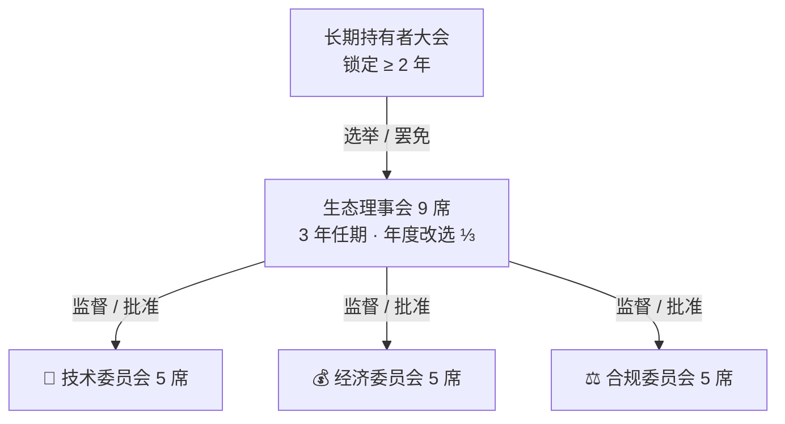
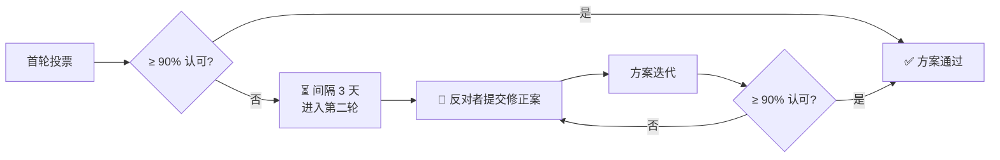

# 治理体系

## 治理哲学

> 短期持有者优化短期利益，长期持有者优化系统价值。

治理权 = **时间加权**。锁定时间越长，投票权重越大。锁定 2 年以上方可参与治理。

## 投票权重公式

$$W_{vote} = K_{locked} \times \sqrt{T_{lock}}$$

| 变量 | 含义 |
|------|------|
| $K_{locked}$ | 锁定 KEY 数量 |
| $T_{lock}$ | 锁定时长（年） |

平方根函数确保时间权重递减，避免无限锁定垄断。

## 治理架构

## 当前理事会

状态：9/9 席位已填满 ✅

| # | 角色 | 地址 |
|---|------|------|
| 1 | Deployer/Admin | [0x424f...25eA](https://etherscan.io/address/0x424f44a2Cb150cC23a0eB41Bc38Fd7b4D3ad25eA) |
| 2 | Oracle 1 | [0x9593...0aB6](https://etherscan.io/address/0x9593dDf6A0e84b1Fd1a8E7B0C3D5c9f2A4B10aB6) |
| 3 | 理事 | [0x90Be...4061](https://etherscan.io/address/0x90Be9A8b7C6d5E4f3a2B1cD0eF8A7b6C5dE44061) |
| 4 | Oracle 3 | [0xc105...6C86](https://etherscan.io/address/0xc105B1E8A9D7c6F5e4A3b2C1d0E9F8A7B6dC6C86) |
| 5 | 理事 | [0x5dD1...0c90](https://etherscan.io/address/0x5dD14d9C8B7A6e5F4B3C2D1E0F9a8B7C6d50c90) |
| 6 | 理事 | [0x033e...34aC](https://etherscan.io/address/0x033e7D6C5b4A3E2f1C0D9B8a7F6e5D4c3B2A34aC) |
| 7 | 理事 | [0x0673...A63a](https://etherscan.io/address/0x06735d4c3B2a1E0F9D8c7B6A5e4F3d2C1b0A63a) |
| 8 | Oracle 2 | [0x4Dd4...31AD](https://etherscan.io/address/0x4Dd4B2A1C0d9E8F7c6B5A4e3D2f1C0B9a831AD) |
| 9 | 测试 | [0xd8A1...47Da](https://etherscan.io/address/0xd8A1B9C8d7E6f5A4b3C2d1E0F9a8B7c6D5e47Da) |

## 投票门槛

| 事项 | 参与率门槛 | 通过条件 |
|------|-----------|---------|
| Oracle 白名单增删 | 10% 投票权 | 70% 赞成 |
| 贡献权重参数调整 | 15% 投票权 | 75% 赞成 |
| 经济价值乘数 $M$ 调整 | 20% 投票权 | 80% 赞成 |
| 协议升级 | 25% 投票权 | 85% 赞成 |
| 理事会选举 | 15% 投票权 | 排名前 N 当选 |
| 紧急暂停 | 理事会 5/9 | 72h 后自动失效 |

## 锁定与解冻机制

- **常规解冻**：锁定到期后分 **12 个月线性释放**
- **释放期间**：投票权重按剩余锁定比例递减
- **提前解冻**：扣除 **20%**（进入生态基金）+ 丧失当届投票权

## 90-99% 认可度机制

目标不是「多数压倒少数」，而是**方案迭代到几乎所有人都能接受**。
