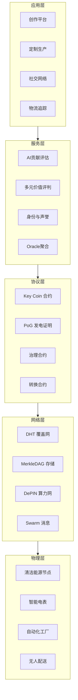
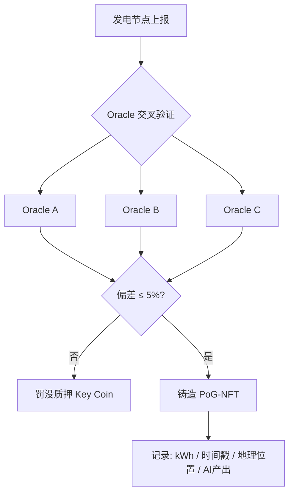
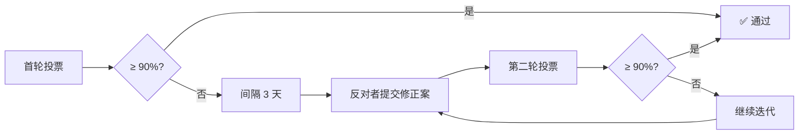
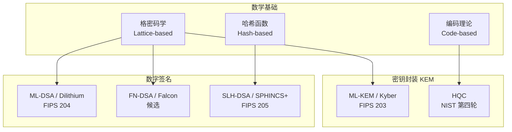
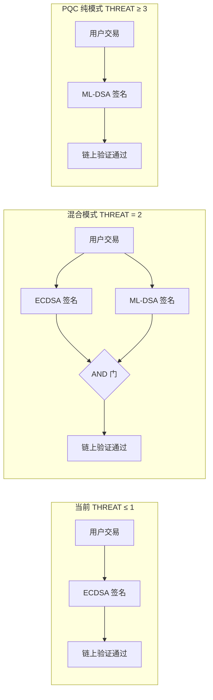
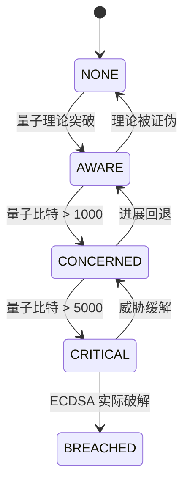
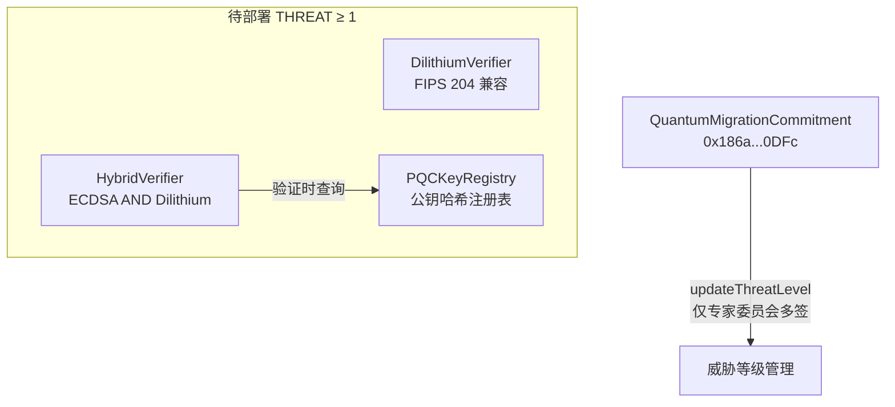

# 技术架构

## 七层基础设施栈



| 层级 | 职责 |
|------|------|
| 物理层 | 清洁能源节点、智能电表、自动化工厂、无人配送硬件 |
| 网络层 | 去中心化消息路由、内容寻址存储、算力调度 |
| 协议层 | ERC20 代币、PoG 共识、治理投票、跨链转换 |
| 服务层 | AI 贡献量化、价值评判、身份管理、数据聚合 |
| 应用层 | 面向用户的创作、生产、社交、物流工具 |

## Proof-of-Generation (PoG)

PoG 不同于 PoW/PoS 的传统挖矿。**发电即证明。**



- **≥3 个独立 Oracle** 交叉验证
- 偏差 > 5%：罚没质押 Key Coin
- 通过后生成 PoG-NFT，记录 kWh、时间戳、地理位置、AI 产出

## AI 贡献评估

**核心公式：**

$$V^t = \sum_{i} w_i \times (e_i^t \times c_i^t)$$

| 维度 $(i)$ | 含义 | 权重示例 |
|-----------|------|---------|
| 1 | 电力贡献 | 基础权重，不可伪造 |
| 2 | 原创设计 | AI 计算语义距离 |
| 3 | 社区互动 | 深度互动加权 > 浅层点赞 |
| 4 | 迭代优化 | 衍生作品增量贡献 |

## 90-99% 认可度机制

多轮投票 → 方案迭代 → 趋近共识。杜绝 51% 暴力民主。



## 合约架构

| 合约 | 地址 | 功能 | 验证 |
|------|------|------|:--:|
| KeyCoinAnchor | [0xf2ad...4138](https://etherscan.io/address/0xf2ad88977E8A687b9EE5c7636e0aC4eBBDcC4138) | ERC20 + 铸造 | ✅ |
| KeyCoinLocking | [0x2c5b...291f](https://etherscan.io/address/0x2c5b6E7Ccf2ebDfA4d3c4E7f9Ad2B1AbeE1291f) | 锁仓 + 时间加权投票 | ✅ |
| KeyCoinGovernor | [0x87a0...6f91](https://etherscan.io/address/0x87a0d4C8B9e6F3A2b1D5c7E9fA0B3C6d2E8f46f91) | 理事会 + 提案 | ✅ |
| QuantumMigrationCommitment | [0x186a...0DFc](https://etherscan.io/address/0x186a31AAF4e025a3475A7977005504E7AdCE0DFc) | 量子安全承诺 | ✅ |

---

<a name="pqc"></a>

# 后量子密码学（PQC）技术架构

> Key Coin 郑重承诺：在量子计算机对 ECDSA 构成实质威胁之前，完成全网 PQC 迁移。此承诺不可撤销，已写入 QuantumMigrationCommitment 合约。

## 威胁模型

量子计算机对区块链的威胁来自三个方向：

### Shor 算法 — 非对称加密的终结者

Shor 算法可在多项式时间内破解 RSA 和 ECDSA 的数学基础。以太坊使用的 secp256k1 曲线在足够容错的量子计算机面前毫无还手之力。

$$N = p \times q \quad\rightarrow\quad f(x) = a^x \bmod N \quad\rightarrow\quad \text{QFT 找周期 } r \quad\rightarrow\quad p,q = \gcd(a^{r/2} \pm 1, N)$$

### Grover 算法 — 对称加密的削弱者

Grover 算法将穷举搜索复杂度从 $O(N)$ 降为 $O(\sqrt{N})$。Keccak-256 的抗原像能力从 256-bit 降至 128-bit。对策：哈希输出加长至 384-bit 或直接用 SHAKE-256。

### HNDL（先收割后解密）— 当下最紧迫威胁

攻击者今天截获并存储加密交易数据，等量子计算机成熟后解密。即使量子计算机还需要 5-10 年，需要长期保密的数据现在就已暴露在风险中。

## NIST 标准化全景

NIST 自 2016 年启动全球 PQC 算法征集，2024 年 8 月 13 日正式发布首批三个 FIPS 标准：

| FIPS 标准 | 算法原名 | 数学基础 | 用途 | NIST 安全级别 |
|-----------|---------|---------|------|:--:|
| FIPS 203 | ML-KEM (CRYSTALS-Kyber) | 格密码 (Module-LWE) | 密钥封装 KEM | 1 / 3 / 5 |
| FIPS 204 | ML-DSA (CRYSTALS-Dilithium) | 格密码 (MLWE/MSIS) | 数字签名 | 2 / 3 / 5 |
| FIPS 205 | SLH-DSA (SPHINCS+) | 哈希函数 | 数字签名（备份） | 1 / 3 / 5 |

2025 年 3 月，NIST 选定编码基算法 HQC 作为额外 KEM 进行标准化，实现「格 + 编码 + 哈希」三角支撑。

### 全球迁移时间共识

| 时间节点 | 事件 | 来源 |
|----------|------|------|
| 2025 | 软件/固件签名、浏览器/服务器 → PQC 默认 | NSA CNSA 2.0 |
| 2027 | 操作系统 → PQC 默认 | NSA CNSA 2.0 |
| 2028 | 组织完成加密资产发现，制定迁移计划 | NCSC |
| 2030 | 弃用 ≤112-bit 强度的经典非对称算法（含 RSA-2048） | NIST IR 8547 |
| 2031 | 高优先级系统完成 PQC 迁移 | NCSC |
| 2035 | 全面禁用经典非对称加密，PQC 迁移完成 | NIST + NCSC + 欧盟 |

## 算法家族



### 格密码（Lattice-based）— 主力军

安全性基于高维格上 SVP（最短向量问题）和 CVP（最近向量问题），均为 NP-hard。

**ML-KEM (Kyber) — 密钥封装**

建立在 Module-LWE 问题上。直观理解：给出大量「被加噪」的线性方程 $A \cdot s + e = b$，从 $b$ 恢复秘密向量 $s$ 在经典和量子环境下都困难。

流程：
1. **密钥生成**：随机矩阵 $A$ + 小秘密向量 $s$ → 公钥 $(A, t = A \cdot s + e)$
2. **封装**：对方用 $r$ 加密 → 密文 $(u, v)$ → 派生共享密钥
3. **解封装**：用 $s$ 从密文恢复共享密钥（利用误差有界性纠错）

性能基准：6000 次封装/秒，3500 对密钥生成/秒。

**ML-DSA (Dilithium) — 数字签名**

采用 Fiat-Shamir with Aborts 设计范式。签名过程中如果响应向量 $z$ 系数过大则「abort」重试，防止秘密向量分布泄漏。

关键特性：支持批量签名验证 — 在「单一密钥 + 多条消息」场景下比逐条验证快 20%-50%。

性能基准：1000 次签名/秒，3000 次验签/秒。

### 哈希签名（Hash-based）— 安全备胎

SLH-DSA (SPHINCS+) 仅依赖哈希函数的抗碰撞性，是安全性假设最保守的方案。

结构：WOTS+ 一次性签名 → Merkle Tree 聚合 → Hypertree 多层嵌套。

代价：签名尺寸 8-50 KB（vs ECDSA 的 64 字节，Dilithium 的 ~2.4 KB），签名速度慢 1-2 个数量级。在 TLS 高频握手中仅作为备选。

### 编码密码（Code-based）— 多样性保障

HQC 基于综合症解码问题（NP-complete），自 1978 年 McEliece 方案以来经受 40+ 年密码分析。NIST 选它为 Kyber 的「数学基础不同」的备份 — 万一格密码出现理论突破，HQC 提供逃生通道。

## Key Coin PQC 迁移架构

### 混合签名模式 — 过渡核心

Key Coin 采用 **Hybrid AND 模式**（非 OR）：

$$\text{有效签名} = \text{ECDSA}(secp256k1) \text{ 验证通过 } \mathbf{AND} \text{ ML-DSA}(Dilithium) \text{ 验证通过}$$

不是「二选一」——两个都通过才算有效。防止攻击者降级攻击强制使用仅 ECDSA 的弱模式。



### 密码敏捷性设计

核心原则：算法选择与业务逻辑解耦。永不在合约中硬编码算法。

```solidity
// ❌ 硬编码 — 不可取
require(ecrecover(hash, v, r, s) == signer, "invalid")
```

```solidity
// ✅ 密码敏捷 — 可升级
interface ISignatureVerifier {
    function verify(bytes32 hash, bytes calldata signature, address claimedSigner)
        external view returns (bool);
}
```

验证器合约可插拔替换：`ECDSAVerifier` → `HybridVerifier` → `DilithiumVerifier`，无需改动业务合约。

## 五级威胁响应机制

| 等级 | 名称 | 触发条件 | 系统行为 | 用户操作 |
|:--:|------|---------|---------|---------|
| 0 | NONE | 当前状态 | 正常运作，PQC 算法库持续集成到测试网 | 无需操作 |
| 1 | AWARE | 量子计算理论突破（Shor 算法实验验证 ≥ 10 比特） | 测试网部署 Dilithium 验证器，开放 PQC 密钥注册 | 可选：提前生成 PQC 密钥对 |
| 2 | CONCERNED | 逻辑量子比特 > 1000 或等效容错量子比特 > 100 | 混合签名模式上线，ECDSA + ML-DSA 双重验证 | 建议：注册 PQC 公钥哈希 |
| 3 | CRITICAL | 量子计算机接近破解 256-bit ECDSA（估计 ≥ 5000 逻辑量子比特） | 自动冻结非 PQC 高价值交易（>10 万 KEY），90 天迁移截止 | 必须：完成 PQC 密钥注册 |
| 4 | BREACHED | ECDSA 已被实际破解 | 仅 PQC 签名有效，非 PQC 交易永久拒绝 | 非 PQC 地址资产冻结，需通过治理提案恢复 |

### 升级流程



每次等级变更需要：
1. ≥ 3 名量子安全专家委员会成员多签确认
2. 附带 IPFS 证据链接（学术论文、NIST 公告、行业报告）
3. 链上事件永久记录

## 密钥与签名尺寸对比

| 算法 | 公钥 | 私钥 | 签名/密文 | 安全级别 |
|------|------|------|----------|:--:|
| ECDSA (secp256k1) | 33 B | 32 B | 64 B | 经典 128-bit |
| ML-DSA (Dilithium) | 1.3 KB | 2.5 KB | 2.4 KB | NIST L2 (128-bit PQ) |
| ML-DSA (Dilithium-5) | 2.6 KB | 4.9 KB | 4.6 KB | NIST L5 (256-bit PQ) |
| SLH-DSA (SPHINCS+-128s) | 32 B | 64 B | 7.9 KB | NIST L1 |
| FN-DSA (Falcon-1024) | 1.8 KB | 2.3 KB | 1.3 KB | NIST L5 |
| ML-KEM (Kyber-768) | 1.2 KB | 2.4 KB | 1.1 KB (密文) | NIST L3 |

## 侧信道攻击与故障注入防御

PQC 算法的数学安全性 ≠ 物理实现安全性。高性能实现（如 NTT 数论变换）在功耗、时序、电磁辐射上可能泄漏秘密。

### 已知攻击向量

| 攻击类型 | 目标 | 方法 | 后果 |
|---------|------|------|------|
| 差分功耗分析 (DPA) | Kyber / Dilithium | 采集数万次运算功耗曲线，统计分析 | 恢复秘密多项式 |
| 模板攻击 | 格密码实现 | 对已知密钥设备建模 → 攻击未知设备 | 恢复完整私钥 |
| 故障注入 (FI) | Dilithium abort 检查 | 跳过循环检查 → 收集错误签名 | 少量错误签名即可恢复私钥 |
| 时序攻击 | 「常数时间」实现 | 利用编译器优化 / CPU 微架构差异 | 泄漏秘密比特 |

### Key Coin 防御策略

| 层次 | 对策 |
|------|------|
| 软件层 | 严格常数时间编码，掩码（masking）+ 随机化（shuffling）双重保护 |
| 硬件层 | HSM/TPM 内执行签名，物理隔离密钥，内建侧信道缓解 |
| 协议层 | 混合 AND 模式：即使 PQC 实现有漏洞，ECDSA 侧仍有保护 |
| 治理层 | 专家委员会持续监控 PQC 实现安全公告，必要时紧急升级合约 |

## 用户迁移流程

```
THREAT = 0-1（当前）：正常使用 ECDSA，无需任何操作
    ↓
THREAT = 2（CONCERNED）：生成 Dilithium 密钥对 → 链上注册 PQC 公钥哈希 → 系统自动启用混合签名，零感知
    ↓
THREAT = 3（CRITICAL）：90 天倒计时开始，所有高价值交易必须使用混合签名，逾期未迁移 → 冻结
```

**PQC 公钥注册交易：** `registerPQCKey(bytes32 pqcPubKeyHash)`

- 仅需提交公钥哈希（32 bytes），极小链上存储开销
- 注册后地址同时绑定 ECDSA 公钥（隐式，即 address）和 PQC 公钥哈希
- 可更新（72 小时时间锁防劫持）

## 链上合约架构



**QuantumMigrationCommitment 合约核心接口：**

```solidity
interface IQuantumMigrationCommitment {
    function currentThreatLevel() external view returns (uint8);
    function upgradeThreatLevel(uint8 newLevel, string calldata evidenceIPFS) external;
    function migrationDeadline() external view returns (uint256);
    function registerPQCKey(bytes32 pqcPubKeyHash) external;
    function pqcKeyRegistered(address user) external view returns (bool, bytes32);
    function verifyHybrid(bytes32 hash, bytes calldata ecdsaSig, bytes calldata pqcSig, address claimedSigner) external view returns (bool);
}
```

当前链上数据：威胁等级 = **2 (CONCERNED)** ✅

## 与全球标准的对齐

| Key Coin PQC 架构 | NIST / 全球标准 | 对齐状态 |
|-------------------|--------------|:--:|
| ML-DSA (Dilithium) | FIPS 204 | ✅ |
| ML-KEM (Kyber) | FIPS 203 | ✅ |
| SLH-DSA (SPHINCS+) | FIPS 205 | ✅ |
| HQC | NIST 第四轮 | ✅ 监控中 |
| 2035 全面迁移 | NIST IR 8547 / NCSC | ✅ |
| 混合 AND 模式 | NIST 白皮书推荐 | ✅ |
| 密码敏捷性 | NIST 加密敏捷性原则 | ✅ |
