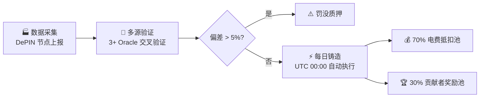
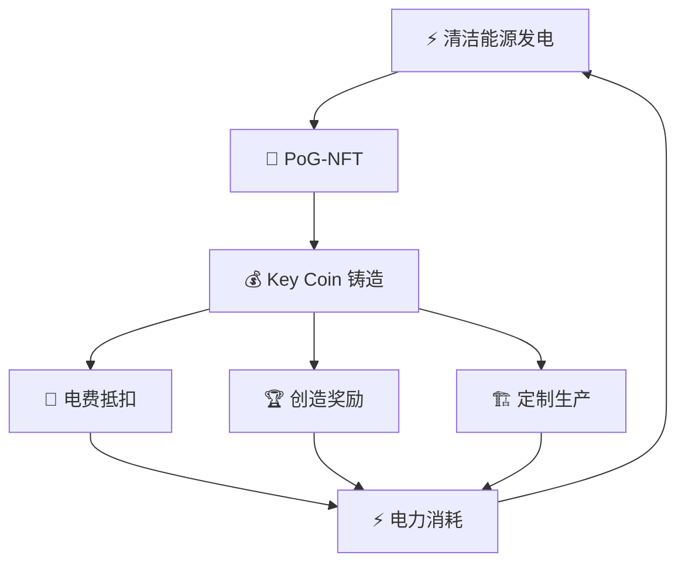

# Key Coin 代币经济

1:1 锚定每日发电量的广义货币

## 锚定公式

$$M = 1 + \frac{V_{AI}}{C_{power}}$$

| 变量 | 含义 |
|------|------|
| $M$ | 经济价值乘数 |
| $V_{AI}$ | 当日 AI 算力网络经济价值（美元计价） |
| $C_{power}$ | 当日发电总成本 |

**示例：** 若日发电 10 亿 kWh，AI 产出价值为发电成本 0.3 倍 → $M = 1.3$ → 当日新增 13 亿 KEY。

## 发行流程 — Proof-of-Generation

## 流通闭环

## 代币分配

| 用途 | 占比 | 说明 |
|------|------|------|
| 电费直接抵扣 | **70%** | 用户/节点自动扣减，覆盖 AI 算力约 70% 成本 |
| 贡献者奖励池 | **30%** | AI 判定后分发给创造者、社区互动者 |

### 生态发展基金（总量的 20%）

| 子项 | 占基金比 | 用途 |
|------|---------|------|
| 创造者基金 | 35% | 创作者、设计师、内容生产者 |
| 开发者基金 | 25% | 协议贡献者、DApp 开发者 |
| 清洁能源基金 | 20% | 清洁能源节点建设补贴 |
| 教育普及基金 | 12% | 全民基础教育内容提供 |
| 社区建设基金 | 8% | 社区组织者、翻译者、布道者 |

## 通胀控制

<h3>⚡ 真实发电量硬约束</h3>

每日发行严格受验证发电量限制，不可超发。物理定律保证货币纪律。

<h3>🔥 自动销毁机制</h3>

Key Coin 用于电费抵扣时部分销毁，流通量自然缩减，维持长期稀缺性。

<h3>🔒 长期锁定减少流通</h3>

治理投票需锁定 2 年以上，大量 KEY 退出流通市场，降低通胀压力。

## 链上数据

| 指标 | 值 |
|------|-----|
| 总供应量 | ~21,474,836 KEY |
| 基础乘数 | 1.0 |
| 最后铸币日 | Day 20582 |
| 锁定中 KEY | 100 KEY（测试） |

## 量子安全承诺

已写入链上 [QuantumMigrationCommitment](https://etherscan.io/address/0x186a31AAF4e025a3475A7977005504E7AdCE0DFc) (`0x186a...0DFc`)，五级威胁响应机制，确保量子时代资产安全。

> 详见 [技术架构](/tech.html) — 量子安全架构章节。
