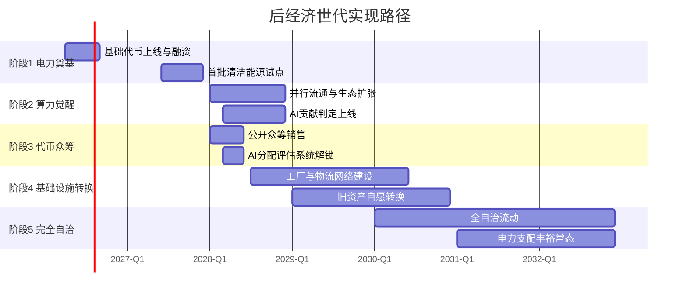
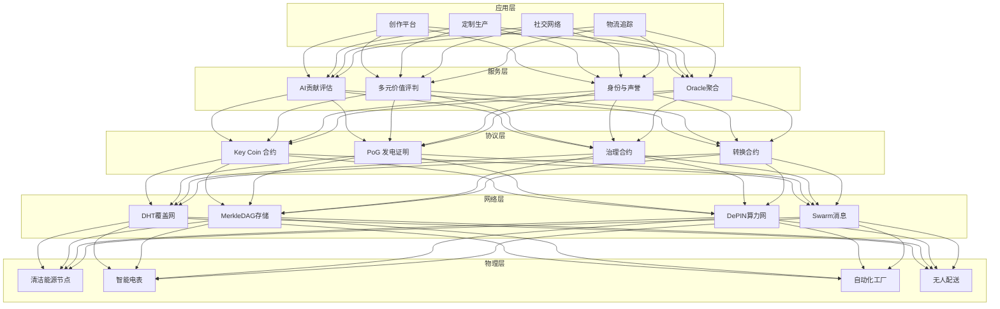
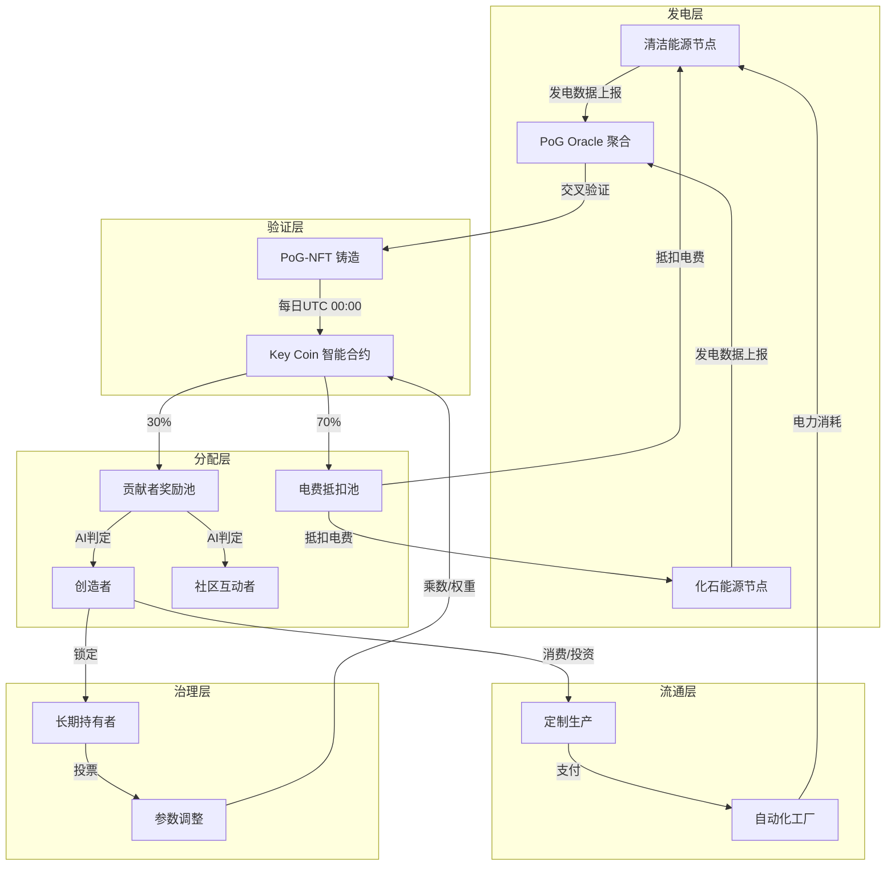
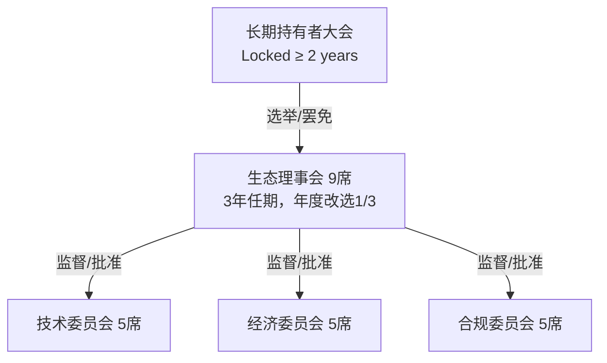
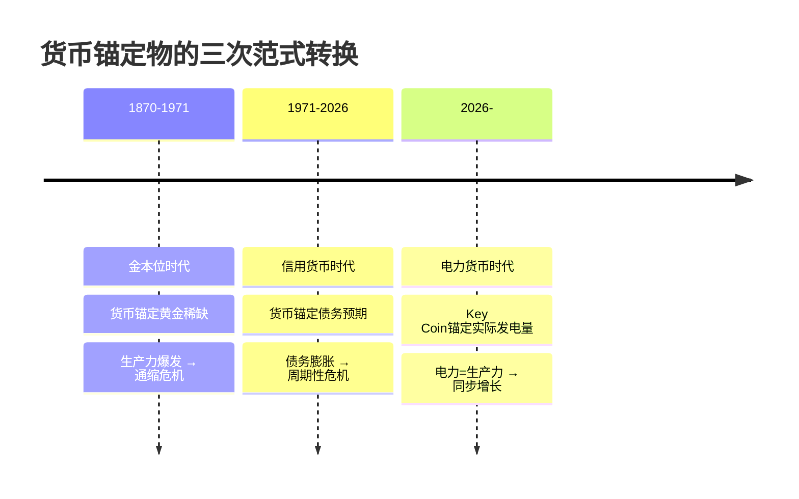
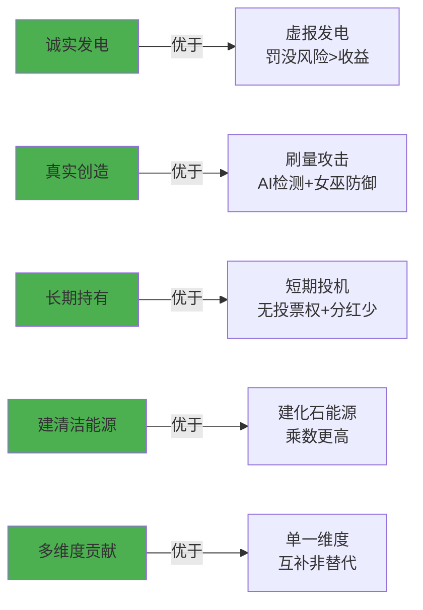

# 后经济世代：电力驱动的AI丰裕经济体系白皮书

**版本：** 1.0
**作者：** [Jorcy_L2e/XACGchain]
**日期：** 2026年4月
**目标读者：** 投资者、技术从业者、年轻一代、政策关注者、能源与创造生态参与者

---

## 执行摘要

2026年2月，Citrini Research发布的思想实验报告《2028全球智能危机》如同一记警钟：AI代理大规模替代白领，可能引发"幽灵GDP"（产出飙升但消费崩塌）、商业中介瓦解、金融违约连锁，最终失业率达10.2%、标普500较2026高点大幅回撤。报告虽被主流机构称为"科幻"，却精准暴露了传统"劳动-消费-金融"循环在AI时代的脆弱性。现代金融已反复三次"先借后危机"循环，中国仅经历2008年一次，后续冲击将更剧烈，伴随民生代价。

**本白皮书提出重建方案**：不拯救旧体系，而是通过软着陆转向**后经济世代**。核心机制是**Key Coin**——1:1锚定每日实际发电量（而非年度GDP）的广义货币，可直接抵消电费（覆盖AI算力约70%核心成本）。结合AI算力网络（72%经济效益锚定电力，制造业硬件28%由网络溢价覆盖），推动清洁能源扩张、全民基础教育普及下的创造时代，最终进入"电力支配人类社会"。

**关键数据支撑**（2026年最新报告）：
- Goldman Sachs Research：全球数据中心电力需求较2023年增长220%（至2030年），美国贡献约60%。
- IEA《Electricity 2026》：全球电力需求2026-2030年年均增长3.6%-3.7%，AI与数据中心是主要驱动，电力增长速度是整体能源需求的2倍以上。
- DePIN赛道：2026年3月已超过650个活跃项目，AI算力与能源DePIN快速增长，为分布式基础设施提供成熟范例。

**益处**：先实现30%愿景，即可极大改善生活。年轻人可做喜欢的事获Key Coin收益，或选择基础保障"躺平"；旧债务危机被打破，社会回归多元中立价值评判（追求90-99%认可度，而非51%过半数）。

**行动号召**：2026年第二季度，Key Coin基础代币将正式上线并启动融资。我们诚邀全球投资者、技术从业者、创造者、能源企业和普通用户一同加入，共建这一生态——您的参与，将直接塑造后经济世代。

---

## 前言　构建后经济世代

想象2028年的小李，一个普通的年轻设计师。他早上醒来，不用担心电费——Key Coin账户每天自动到账基础份额，足够体面生活。他对音乐感兴趣，昨晚在去中心化网络上传了一首AI辅助创作的曲子。几分钟后，AI系统（基于完整高性能算法）中立判定贡献值，额外Key Coin到账。

他需要一部个性化手机：不用摄像头，只想极致轻薄。在平台提交设计，AI立即联动自动化全产业集成工厂，仅用少量Key Coin，几天后定制产品通过自动化物流系统送达。没有中间商加价，没有品牌绑架——一切高效公平。

与此同时，旧世界在Citrini报告阴影下挣扎：白领失业推高储蓄率，消费崩塌，私募信贷违约波及养老金。但小李的世界不同：电力不再是成本，而是货币；AI不是屠夫，而是助手；价值由多元系统（90-99%认可）中立衡量。

**这就是后经济世代**：我们不等待危机，而是现在搭建桥梁。Key Coin + AI算力网络，让生产丰裕、分配公平、人类专注创造与意义。Citrini五环崩溃链条将被"制动器"取代：电力激励建电，AI辅助创造，全民基础教育普及能力。

**现实数据印证紧迫性**：
- 数据中心电力需求激增（Goldman Sachs 220%增长预测）。
- IEA显示AI与数据中心驱动全球电力需求强劲增长。

我们的叙事：从"AI屠宰场"恐惧，转向"电力丰裕+全民创造"的震撼愿景。人们既被利益吸引（Key Coin抵消成本、创造获益），也被美好打动（做喜欢的事、体面生活）。

去中心化，是后经济世代本来的样子。

---

## 0. 债务的三种形态：一部货币锚定物的演进史

### 0.1 黄金的锁链（1870-1971）

1870年代，世界主要经济体相继拥抱金本位。每一张流通的纸币，都可以按固定比率兑换成地壳里挖出来的黄金。

这套体系的隐含逻辑是：**人类生产力的边界，由一种金属的自然稀缺性划定。** 黄金每年新增约1.5%-2%，全球经济也以此速度"被允许"增长。当工业革命的生产力爆发超越黄金供给，结果不是繁荣，而是通缩——商品增多，货币不变，物价下跌，债务实际负担加重。

1893年恐慌、1907年银行危机、1930年代大萧条——每一次危机的底层都是同一个剧本：**实体经济的创造力被货币锚定物的物理稀缺性窒息。**

1944年布雷顿森林体系试图修正：美元挂钩黄金（$35/盎司），各国货币挂钩美元。这个"黄金-美元双锚"撑了27年。1971年8月15日，尼克松关闭黄金窗口——不是美国选择了放弃金本位，是金本位已经无法容纳战后全球贸易量和生产力。

黄金锁链断裂的那一刻，人类经济进入了一个前所未有的实验。

### 0.2 债务的螺旋（1971-2026）

美元脱钩黄金后，世界进入**纯信用货币时代**。货币不再由金属背书，而是由"对未来税收的预期"——也就是债务——背书。

这带来了惊人的增长，也带来了惊人的脆弱性。以下是现代金融体系经历的三次完整债务循环：

| 危机 | 触发机制 | 应对方式 | 代价承担者 |
|------|---------|---------|-----------|
| 2000年互联网泡沫 | 权益资本过度扩张 | 降息→房地产膨胀 | 散户投资者 |
| 2008年全球金融危机 | 房地产债务证券化失控 | 量化宽松+政府救助 | 全球纳税人 |
| 2026年（Citrini预警） | AI替代白领→消费崩塌→信贷违约 | ？ | ？ |

**模式是清晰的**：每次危机后，系统不是被修复，而是通过更大的债务扩张来推迟清算。全球债务从2000年的约$80万亿膨胀到2025年的约$315万亿。每一美元GDP背后，站着超过3美元的债务。

更值得警惕的是**中国的位置**。中国仅完整经历了2008年一次全球债务危机冲击——通过4万亿刺激和房地产扩张消化。这意味着一旦下一次冲击来临，缓冲机制和经验储备都远不如经历过三次完整周期的西方体系。民生代价将更为直接。

### 0.3 电力的觉醒（2026- ）

Citrini Research的《2028全球智能危机》之所以重要，不是因为它的预测精确，而是因为它揭示了一个**结构性断裂**：

传统"劳动-消费-金融"循环的隐含前提是——**人类是生产者和消费者的统一体。** 你工作获得收入，收入用于消费，消费驱动生产，生产需要你的工作。这个闭环运转了200年。

AI打破了这个统一体。AI可以生产（产出计入GDP），但AI不消费。当AI大规模替代白领——不是蓝领的体力劳动，而是分析师、程序员、设计师、律师助理——GDP继续增长（AI产出），但消费崩塌（被替代的人停止消费）。

这就是Citrini说的"幽灵GDP"：**生产与消费的同一主体被撕裂了。**

这不是周期性危机。这是**结构性的循环断裂**。降息、QE、财政刺激——所有传统工具箱都针对"需求不足"，而这次的问题是"需求主体消失"。

### 0.4 Key Coin的历史定位

回到货币锚定物的演进逻辑：

| 体系 | 锚定物 | 约束类型 | 核心矛盾 |
|------|--------|---------|---------|
| 金本位 | 金属稀缺 | 物理约束 | 生产力超越锚定物 → 通缩 → 危机 |
| 信用货币 | 债务预期 | 时间约束 | 债务增长超越生产力 → 杠杆 → 危机 → 更大债务 |
| **Key Coin** | **实际发电量** | **能量约束** | 电力 = 真实生产力的即时表达 |

黄金锚定的问题：生产力超越锚定物 → 通缩 → 危机。
债务锚定的问题：债务增长超越生产力 → 杠杆→ 危机 → 更大债务。
电力锚定的逻辑：**每一度电都是真实生产力的即时表达。** AI算力消耗电力，工业生产消耗电力，物流运输消耗电力。电力是唯一横跨数字世界和物理世界的普适价值尺度。

当Key Coin 1:1锚定每日发电量：
- 发电量增长 = 真实生产力增长 = 货币供给增长 → **无通缩**
- 发电量不会脱离物理基础设施凭空膨胀 → **无恶性通胀**
- AI算力消耗电力 → AI的"生产"自动产生货币需求 → **幽灵GDP被消除**

这就是Key Coin在货币演进史中的位置：**不是另一种加密货币，而是货币锚定物从"稀缺性"（黄金）到"债务预期"（法币）再到"能量流"（电力）的范式转换。**

### 0.5 软着陆：后经济世代的桥梁使命

我们不幻想一夜之间取代现有金融体系。那是灾难性的硬着陆。

后经济世代是**软着陆的中间载体**：
- 阶段1-2：Key Coin与传统货币并行，先在能源+算力垂直场景建立闭环
- 阶段3-4：网络效应形成，自愿转换机制启动，旧金融资产有序映射
- 阶段5：当覆盖率达到临界点，"债务"不再驱动社会运行——因为生产与消费的循环已通过电力锚定重新闭合

这不是乌托邦。这是工程问题。

---

## 1. 什么是后经济世代？

后经济世代是基于区块链与AI算力网络的去中心化丰裕协议，其目标在于通过Key Coin锚定与分布式AI技术，构建一个全球范围内的电力支配经济体系。这个协议可以让每个用户自由创造、存储、拥有贡献数据，并通过去中心化的自治形式，以Key Coin发行、流通、交易方式决定价值的分配、激励、共享，赋能内容与创造者，形成去中心化的丰裕创造生态。

后经济世代结合了价值网络与AI生产力的双重优点，将协议生态繁荣置于首位。在任何一个社区、经济体、自由市场中，一个公平并合理反映参与者贡献的激励系统是社区立足之本。后经济世代将首次利用Key Coin去尝试准确透明地衡量与激励生态的参与者与贡献者，赋能全民创造。

| 维度 | 旧经济（劳动-消费-金融循环） | 后经济世代（电力-创造-分配循环） |
|------|---------------------------|--------------------------------|
| **价值锚定** | 债务预期（法币） | 每日实际发电量（Key Coin） |
| **生产驱动** | 资本雇佣劳动 | AI + 电力 + 人类创造 |
| **分配逻辑** | 工资制（劳动时间定价） | 贡献制（电力+创造力多维评估） |
| **数据所有权** | 平台私有 | 用户完全拥有 |
| **治理模式** | 股东投票（51%规则） | 长期持有者治理（90-99%认可） |
| **能源角色** | 成本项 | 货币本身 |

---

## 2. 后经济世代的价值观

在设计后经济世代之初，如下核心价值观被贯彻始终：

1. **数据与贡献产生者（用户）将会拥有对于贡献的根本所有权**，经济体系应当以去中心化的形态存在。这一逻辑在后经济世代诞生之初提出，是电力丰裕的初心。

2. **每个为后经济世代生态做出贡献的人，都将按照规则获得按比例的收益。** 价值网络的最大优势，在于能够将创造与AI网络中的一点一滴电力资产化。

3. **所有形式的贡献都应具有同等的量化价值。** 例如，参与者投入的时间、制作优秀作品、注意力本质来说与提供算力具有同等衡量价值。

4. **后经济世代的根本目的是服务于大众。** 它是由非盈利基金会所运行的生态，其目标是创造并服务全球享受丰裕创造的大众，而并非创造利润。后经济世代的所有参与者将会受益于生态本身的繁荣。

5. **创造应当产生于人，而非资本，资本应用于奖励人，而非控制人。** 例如，AI生产力的核心推动力应当是对于创造本身质量的追求，需求应来自于创作者、设计师，而非本身并不创造的资本家。

---

## 3. 后经济世代所提供的基础设施

后经济世代不是单一产品，而是一套**垂直整合的去中心化基础设施栈**。七层架构各自独立可替换，协同运作时构成从电力生产到个性化消费的完整闭环。

### 3.1 高质量创造的内容与产品平台

一个抗审查的去中心化创作层。用户上传的不只是"内容"——设计图纸、音乐作品、软件代码、硬件规格、制造指令——都被视为**可确权的创造资产**。平台层提供：
- 基于 IPFS + Filecoin 的永久存储
- 创作指纹（Content Hash）自动上链存证
- AI 辅助创作工具接口（文生图、代码生成、设计优化）

区别于 Web2 平台：没有算法推荐操控、没有广告竞价排名、没有平台抽成。用户看到的是**自己想看的**，而非平台想让用户看的。

### 3.2 连接所有人的 AI 社交与贡献网络

这不是另一个社交 App。这是基于 DHT 覆盖网的**贡献关系图谱**：
- 每个用户拥有独立的身份 NFT（Soulbound）
- 关注关系 = 贡献订阅，新作品通过 Swarm 机制实时推送
- AI 代理为每个用户建立"兴趣-技能-贡献"三维画像，用于精准匹配协作
- 加密 DM 与提及机制确保私密沟通

### 3.3 桥梁电力货币——Key Coin

1:1 锚定每日发电量 + AI 经济价值乘数。详见第 8 章。

### 3.4 支付与分配网络

基于智能合约的即时结算层：
- Key Coin 转账零 Gas（通过 Layer 2 批量处理）
- 贡献评估 → 奖励分配全流程自动化
- 支持流支付（Streaming Payment）：按秒分配的持续奖励
- 与电网/能源企业 API 打通，实现电费直接抵扣

### 3.5 生态自治系统

长期持有 Key Coin 的用户组成治理体。详见第 9 章。

### 3.6 自动化全产业集成工厂

AI 驱动的端到端定制化生产网络，核心特征：
- **设计即生产**：用户提交设计文件 → AI 解析制造指令 → 自动匹配最近工厂 → 排产
- **零最小起订量**：单件定制与百万件量产成本曲线趋近（AI 优化排产 + 3D 打印/柔性产线）
- **全流程透明**：每个生产步骤上链，用户实时追踪

当前技术基础：工业 4.0 数字孪生、协作机器人、增材制造已从实验室进入工厂。后经济世代做的是**用 Key Coin 激励将它们编织成网**。

### 3.7 自动化物流系统

电力驱动的无人配送网络：
- 最后一公里：电动无人车 + 无人机（已在中国、美国多个城市商用）
- 长途干线：电动卡车 + 铁路（清洁能源驱动）
- 全球节点：分布式仓储 + AI 预测备货
- 零碳闭环：运输耗电由 Key Coin 锚定，形成"运一单即建一度电"的正反馈

**基础设施互操作示意**：以上七层并非孤岛。用户上传一个手机设计（3.1）→ AI 社交网络匹配制造合作者（3.2）→ Key Coin 支付（3.3-3.4）→ 自治系统审核品控标准（3.5）→ 集成工厂生产（3.6）→ 物流送达（3.7）。全流程无人工干预、无中间商、零碳。

---

## 4. 后经济世代的特点

后经济世代作为去中心化的丰裕协议，与中心化的旧经济结构相比，具有以下四个基本特征：

### 4.1 数据与电力自由

在旧经济中，你的创造数据存储在平台的服务器上。平台可以删除、降权、限流。在后经济世代，**数据与电力自由**意味着：
- 创造内容通过内容哈希永久存储于分布式网络
- 电力贡献通过 PoG-NFT 确权，不可篡改
- 任何人无法单方面剥夺你的贡献记录
- 自由而不受控制的上传、存储并传播包括创造、设计、源码在内的贡献

### 4.2 创造赋能

旧经济中，创作者获得平台分配的流量（和微薄分成）。后经济世代中：
- AI 中立评估贡献值（非人类评委、非平台算法）
- 85% 奖励直达创造者
- 贡献的"长尾效应"被智能合约固化：一件作品被持续使用，创造者持续获益
- 通过贡献和传播获得应有的Key Coin收益，经济激励赋能全民创造生态

### 4.3 个人电力资产发行

这是后经济世代最激进的创新之一。任何人都可以通过建设清洁能源设施（太阳能屋顶、小型风电、储能系统）发行个人电力资产：
- 发电数据上链，每日铸造对应 Key Coin
- 他人可购买这些资产 = 投资该创造者未来的电力产出
- 形成"建电即有收益、创造即有回报"的正循环
- 个人可以自由的通过发行电力资产，他人则可以通过购买电力资产享受贡献者不断发展所带来的利益与服务

### 4.4 去中心化基础设施

所有基础设施由 AI 算力网络统筹，Key Coin 提供激励与支付闭环。没有单点控制、没有单点故障。清洁能源节点、算力节点、存储节点、工厂节点、物流节点——彼此通过协议通信，而非通过中心调度。分布式的电力资产则会匹配一整套完整的去中心化基础设施，包括分布式算力网络、自治性分配、预测与定制生产系统，以及自动化全产业集成工厂与自动化物流系统。

| 维度 | 旧经济 | 后经济世代 |
|------|--------|-----------|
| 生产模式 | 大规模标准化 | 单件定制零边际成本 |
| 价值分配 | 平台抽成 30-50% | 创造者获 85% |
| 内容可见性 | 算法推荐（可操纵） | AI 中立评估 + 用户自选 |
| 身份 | 平台账号（可封禁） | Soulbound NFT（不可剥夺） |
| 退出权 | 数据留在平台 | 数据完全迁移 |

---

## 5. 后经济世代如何实现激励？

### 5.1 核心问题：丰裕经济的货币化

后经济世代要解决的根本问题是：**当 AI 使生产能力远超人类消费需求时，如何让货币继续有效流转？**

旧答案：所有人必须工作挣工资，才能消费。AI 替代劳动 → 工资消失 → 消费崩塌 → 生产过剩 → 危机。

新答案：**货币挂钩电力（生产力本身），而非挂钩劳动时间。** 电力是 AI 的"食物"，也是工业的"血液"。当每一度电都自动产生可分配货币，AI 生产得越多 → 耗电越多 → Key Coin 铸造越多 → 分配给所有人（通过基础保障 + 创造奖励）→ 消费能力同步增长。

### 5.2 博弈论设计：激励相容的五重保障

Key Coin 激励体系的设计遵循**激励相容**原则——每个参与者追求自身利益的行为，恰好最大化系统整体利益。

**保障一：诚实发电优于虚报发电**

Oracle 多源聚合 + 偏差惩罚机制：
- 上报发电数据需要质押 Key Coin
- 如果 3+ Oracle 交叉验证发现偏差 > 5%，罚没质押
- 诚实节点的期望收益 > 虚报节点的期望收益（即使考虑合谋）

形式化表达：
$$E[诚实] = R_{base} > E[虚报] = R_{base} \times (1-p_{检测}) - S_{罚没} \times p_{检测}$$

其中 \( p_{检测} \) 随 Oracle 数量呈指数增长。

**保障二：创造真实价值优于刷量**

AI 贡献评估采用多维度交叉验证：
- 电力贡献（硬约束，不可伪造）
- 原创性指数量化（与已有作品库的语义距离）
- 社区互动质量（非数量：深度互动加权远高于浅层点赞）
- 迭代优化价值（衍生作品的增量贡献）

刷量攻击（女巫攻击）防御：
- Soulbound 身份 NFT 确保一人一身份
- 新身份需通过"电力贡献证明"（PoG）获得基础权重
- 贡献价值的 90-99% 认可度机制：只有被高度共识认可的贡献才获得高权重

**保障三：长期持有优于短期投机**

- 治理投票权仅限多年阶段性解冻的 Key Coin
- 提前解锁 = 丧失投票权 + 按比例扣除
- 长期持有者获得生态发展基金的额外分红

**保障四：建电优于耗电（清洁能源倾斜）**

- 清洁能源发电的 Key Coin 乘数高于化石能源
- 清洁能源节点获得额外贡献权重
- 驱动清洁能源占比从当前 ~30% 向 90%+ 演进

**保障五：贡献多样性优于单一维度**

权重公式确保四种贡献类型的互补而非替代：
$$V^t = \sum_{i=1}^{4} w_i \cdot (e_i^t \times c_i^t)$$

电力贡献者（i=1）、创作者（i=2）、社区互动者（i=3）、迭代优化者（i=4）各自在最擅长的维度获取收益，形成**多维度贡献生态**。

### 5.3 与传统平台的对比

| 机制 | 传统平台（Web2） | 后经济世代 |
|------|---------------|----------|
| 价值分配 | 平台抽成 30-50% | 创造者获 85% |
| 内容可见性 | 算法推荐（可操纵） | AI 中立评估 + 用户自选 |
| 刷量防御 | 中心化风控（不透明） | 密码学 + 博弈论透明防御 |
| 身份 | 平台账号（可封禁） | Soulbound NFT（不可剥夺） |
| 退出权 | 数据留在平台 | 数据完全迁移 |

### 5.4 贡献价值评分公式

后经济世代将提出一套不断完善的机制来对个人生态贡献进行评估。核心公式：

$$V^t = \sum_{i=1}^{4} w_i \cdot (e_i^t \times c_i^t)$$

其中：
- \( w_i \): 电力贡献(1)、原创设计(2)、社区互动(3)、迭代优化(4)等权重
- \( e_i^t \): 第i类贡献的能量效率（AI实时计算，避免重复劳动）
- \( c_i^t \): 第i类贡献的创造力指数（AI根据独特性、新颖度动态评分）

现有的绝大多数平台采用单用户一票制，这样的机制很容易被刷量与垃圾请求控制和攻击。现在的旧经济平台已经被盈利诉求与中心化的机制所控制，我们看到的内容都是平台希望我们看到的，而并非我们希望看到的。

而后经济世代则希望通过去中心化的方式，将经济激励系统本身变为能够在系统内进行循环的体系，用户能真正拥有一个享受自己喜欢创造的平台，同时也不会与平台的盈利诉求冲突。后经济世代所形成的自治体系，也将前所未有的赋能于生态成员，使得其形成生态自治，而非现在早已沙化的扁平用户机制。

---

## 6. 后经济世代的实现路径

对于后经济世代来说，其整个体系的实现预计将会是一个为期8-10年的工程，涉及5个步骤的庞大工程。每阶段设有可验证的里程碑 KPI，确保从愿景到落地的每一步都可被社区和投资者追踪。

### 阶段 1：电力奠基（2026 Q2-Q4）

**核心目标**：基础代币上线，完成初始融资与合规框架，启动首批清洁能源试点。

| 里程碑 | KPI | 验证方式 |
|--------|-----|---------|
| Key Coin 基础代币合约部署 | 测试网 100% 通过率，主网上线 | Etherscan 开源验证 |
| 社区融资完成 | $5M-$20M（依社区规模） | 链上融资合约余额 |
| 首批清洁能源试点 | 3-5 个节点接入，日发电数据上链 ≥ 1MWh | PoG-NFT 可查 |
| 全民基础教育平台 MVP | 覆盖 3 门课程，1000+ 注册用户 | 平台 DAU 数据 |
| 合规框架 | 至少 1 个主流司法辖区法律意见书 | 官网公示 |

**资金分配**：AI 算力网络与清洁能源试点 40% / 全民基础教育平台 30% / 合作伙伴整合 20% / 合规审计与风险缓冲 10%。

2026年4月1日基础代币上线，4月10日支持早期提现与流通测试。

### 阶段 2：算力觉醒（2027 H1-H2）

**核心目标**：Key Coin 与传统货币并行流通，算力-电力-货币闭环形成，首批用户试点。

| 里程碑 | KPI | 验证方式 |
|--------|-----|---------|
| Key Coin 流通商户 | 500+ 商户支持 Key Coin 支付/抵扣 | 商户地图实时更新 |
| 清洁能源节点 | 100+ 节点，日发电验证 ≥ 100MWh | PoG 链上数据 |
| DePIN 算力节点 | 1,000+ 活跃节点 | DePIN 浏览器 |
| AI 贡献判定上线 | 日均处理 10,000+ 贡献评估 | 合约事件日志 |
| 定制生产试点 | 100 单成功交付（设计→工厂→物流） | 全流程链上存证 |
| 用户基数 | 100,000+ 注册用户 | Soulbound NFT 铸造量 |

### 阶段 3：代币众筹销售（2028 Q1-Q2）

**核心目标**：公开众筹，解锁算力网络核心模块，大规模扩展生态。

| 里程碑 | KPI |
|--------|-----|
| 众筹金额 | $50M-$200M |
| 众筹参与者 | 50,000+ 地址 |
| AI 分配评估系统上线 | 贡献判定延迟 < 10 秒 |
| 多元价值评判引擎 | 90-99% 认可度机制运行 |
| 生态合作伙伴 | 50+ 能源企业/工厂/物流公司接入 |

众筹完毕后，立即解锁算力网络核心模块与AI分配评估系统（贡献判定算法、多元价值评判引擎），让早期参与者率先体验Key Coin激励与创造赋能。

### 阶段 4：基础设施转换（2028 H2-2030）

**核心目标**：基础设施完整，旧资产自愿转换，全面解锁用户权限。

| 里程碑 | KPI |
|--------|-----|
| 自动化全产业集成工厂 | 10+ 工厂接入，覆盖 5 大品类 |
| 自动化物流系统 | 全球 50+ 节点，7 日达覆盖 80% 人口 |
| 旧资产转换量 | $10B+ 传统资产通过智能合约转换为 Key Coin |
| 清洁能源占比 | 系统内发电 > 60% 来自清洁能源 |
| 全民基础教育平台 | 100+ 课程，1M+ 用户，覆盖 20+ 语言 |
| 活跃用户 | 10M+ |

旧金融资产与传统货币可通过智能合约1:1或按规则转换为Key Coin，实现软着陆。转换完成后，全面解锁所有用户接入基础设施权限：任何人均可自由上传创造、提交设计、参与定制生产，Key Coin成为全球入场券。

### 阶段 5：完全分配自治（2030+）

**核心目标**：系统无需外部干预，电力支配人类社会，创造与保障并行。

| 特征 | 描述 |
|------|------|
| 治理全自治 | 无中心化团队，所有决策由长期持有者投票 |
| Key Coin 完全流通 | 全球主要经济体可日常使用 |
| 债务清零机制 | 旧金融体系债务通过转换/销毁完成软着陆 |
| 基础保障全覆盖 | 每个用户的基础 Key Coin 份额 ≥ 体面生活线 |
| 创造生态繁荣 | 日均创造上传量 1B+，AI 判定全自动化 |

### 五阶段实现路径图



**技术实现要点**（已部分完成）：终端AI统筹-分端AI管控-端到端设备的分层体系，结合高性能算法确保贡献判定的中立性。自动化全产业集成工厂与自动化物流系统由同一分层AI架构驱动，实现从设计到交付的零人工闭环。

**传播与落地原则**：以故事化+数据驱动形式呈现，发布于易出圈平台。聚焦真实用户增长与合作伙伴凝聚力。

---

## 7. 后经济世代技术体系

### 7.1 文件存储与电力锚定协议

后经济世代底层由多层协议栈组成，每层可能采用多种实现方式，以模块方式组合。层间定义接口标准，包含五个层次：名字层、MerkleDAG层、互换层、路由层、网络层。



### 7.2 存储网络的自运行

后经济世代是一个无中心的电力算力网，将存储与算力从云模式转变为基于算法和规则运作的市场模型。市场以区块链为基础，基于虚拟货币Key Coin进行交易：矿工/节点通过提供存储与算力给客户端赚取Key Coin；客户端花费Key Coin雇佣节点。挖矿能力正比于提供的电力贡献与算力空间，形成极强驱动激励。

**Proof-of-Replication (PoRep) 与 Proof-of-Spacetime (PoSt) 算法**（适配电力与算力）：服务器（证明者）让用户相信数据与算力任务已被复制存储到多个独立物理位置，并持续有效运行一段时间。

### 7.3 AI贡献网络实现

通过利用现有成熟技术，后经济世代作为新的丰裕平台提供安全、扩展性和私密性，同时采取激励机制让参与者积极贡献机器算力与电力，构建用户注册网络，赋予积极贡献者优先分配特权。

**用户内容与DHT覆盖网**：用户贡献（创造、设计）通过DHT与分布式存储实现快速分发与存储。Swarm机制解决新贡献快速通知问题，用户跟随者无需轮询即可实时接收。

**直接递送与提及机制**：新创造提及用户时，自动通过ID发送通知，支持加密DM，确保私密性。

**自动化全产业集成工厂与自动化物流系统**：由终端AI统筹，分端AI控制工厂生产线与物流机器人，实现个性化设计提交后即时生产与零碳配送。Key Coin直接支付生产与物流成本，形成闭环激励。

### 7.4 解锁机制

- 代币众筹销售完毕后：立即解锁算力网络核心与AI分配评估系统（贡献判定、价值评判引擎）。
- 基础设施建设完整后：全面解锁所有用户接入权限，任何人可自由参与创造、生产、定制。

---

## 8. 后经济世代官方Token - Key Coin

Key Coin是后经济世代的官方代币，1:1锚定每日实际发电量及经济价值。可直接抵消电费，覆盖AI算力70%成本。通过智能合约实现透明分配与激励。

### 8.1 Key Coin锚定机制详解

Key Coin是后经济世代的核心广义货币，其锚定机制是整个体系的基石。它并非传统意义上的"挖矿"或"通胀发行"，而是**1:1实时锚定每日实际发电量（kWh）并叠加经济价值乘数**的动态发行机制。这一设计直接解决Citrini报告中"幽灵GDP"的核心矛盾：AI产出计入GDP但机器不消费，导致货币流通停滞。Key Coin让每一度电都成为可流通、可抵扣、可激励的真实资产，实现"电力即货币、创造即收益"的闭环。

#### 核心锚定规则：1:1 + 经济价值乘数

Key Coin的发行总量每日动态调整，不设固定上限，但严格受真实发电量约束：

- **基础锚定**：每日新增Key Coin = 当日全球/区域验证发电量（kWh） × 1（基础比率）。
- **经济价值乘数**：为避免单纯"度数货币化"导致通胀，同时体现AI生产力，乘数M = 1 + (AI算力产出价值 / 发电成本)。

公式：
$$M = 1 + \frac{V_{AI}}{C_{power}}$$

其中：
- \( V_{AI} \)：当日AI算力网络产生的经济价值（以美元或稳定币计价，通过DePIN节点上报的AI任务完成量计算）。
- \( C_{power} \)：当日发电总成本（主要为清洁能源建设与维护，约占72%电力锚定效益）。

示例：若当日验证发电量为10亿kWh，AI产出价值为发电成本的0.3倍，则M=1.3，当日新增Key Coin=13亿枚。

这一规则确保Key Coin与实体电力完全挂钩：发电越多，Key Coin越多；AI创造越多，乘数越高，形成"建电→算力→创造→更多电"的正反馈。

#### 发行与"开采"流程：Proof-of-Generation（PoG）

Key Coin不通过PoW/PoS传统挖矿，而是**Proof-of-Generation（PoG，发电证明）**机制：

1. **数据采集**：全球DePIN节点（智能电表、太阳能/风电设备、算力节点）实时上报发电量、AI任务完成量。
2. **多源Oracle验证**：采用多Oracle聚合 + Renewable Energy Certificate（REC）协议，至少3个独立Oracle（能源企业、DePIN节点、政府监管接口）交叉验证，避免单点操纵。验证通过后，生成当日"电力证明NFT"（PoG-NFT），记录kWh、时间戳、地理位置、AI产出。
3. **智能合约铸造**：每日UTC 00:00，铸造合约自动执行：
   - 读取PoG-NFT总和。
   - 计算M乘数。
   - 铸造等量Key Coin，并分配：
     - 70%直接抵扣电费（用户/节点自动扣减）。
     - 30%进入贡献者奖励池（AI判定后分发给创造者）。
4. **销毁机制**：当Key Coin用于抵扣电费或支付定制生产时，部分自动销毁，维持稀缺性。

#### 抵扣与流通闭环

- **电费抵扣**：用户持有Key Coin，可通过集成钱包直接抵扣电费（与电网/能源企业API对接）。1 Key Coin = 1 kWh等价价值，覆盖AI算力70%成本。
- **流通场景**：创造奖励、定制生产、转换阶段等。
- **通胀控制**：每日发行受真实发电量硬约束 + 销毁机制 + 长期持有解冻投票治理，确保Key Coin与实体电力同步增长，而非超发。

#### 安全与风险对冲

- **Oracle安全**：多源聚合 + 偏差惩罚（偏差>5%节点罚没质押Key Coin）。
- **治理**：长期持有Key Coin用户投票决定乘数调整、Oracle白名单。
- **合规**：所有发电数据上链可审计，支持政府监管接口。
- **阶段解锁**：代币众筹销售完毕后立即解锁铸造合约与AI分配评估系统；基础设施建设完整后全面解锁全用户接入权限。

### 8.2 Key Coin 流通闭环图



> 图释：Key Coin 从发电到消费的完整闭环。每一度电同时是货币铸造、成本抵扣、创造激励的起点。循环越快，系统越繁荣。

这一锚定机制让Key Coin不再是"虚拟币"，而是**实体电力的数字孪生**。它打破幽灵GDP，实现货币与生产力的同步循环：每新增一度电，都直接转化为可消费、可创造、可分享的财富。

### 8.3 创造激励智能合约示例

```solidity
pragma solidity ^0.8.0;

contract KeyCoinCreatorReward {
    address public platform;

    function rewardCreator(address creator, uint256 contributionValue) public {
        uint256 rewardAmount = contributionValue * 85 / 100;  // 85%直接奖励创造者
        payable(creator).transfer(rewardAmount);
        // 剩余部分进入生态发展基金
    }
}
```

### 8.4 Key Coin 分配评估智能合约示例

```solidity
pragma solidity ^0.8.0;

contract KeyCoinAllocation {
    address public platform;
    mapping(address => uint256) public contributions;

    constructor() {
        platform = msg.sender;
    }

    function recordContribution(address user, uint256 powerGenerated, uint256 creativityIndex) public {
        // AI判定贡献值（电力贡献 + 创造力指数）
        uint256 value = (powerGenerated * 70 / 100) + (creativityIndex * 30 / 100);
        contributions[user] += value;
        // 自动分配Key Coin
    }

    function claimKeyCoin(address user) public {
        require(msg.sender == user, "Only owner");
        // ... 转移逻辑
    }
}
```

### 8.5 量子安全承诺：在风险到来之前完成迁移

#### 承诺声明

**后经济世代郑重承诺：在量子计算机对 ECDSA 签名算法构成实质威胁之前，将整个 Key Coin 网络迁移至后量子密码学（PQC）标准。**

这一承诺不可撤销。它已写入 `QuantumMigrationCommitment` 智能合约并永久存储于区块链上，任何人均可随时验证。

#### 为什么需要量子安全承诺？

当前区块链依赖的 ECDSA（椭圆曲线数字签名算法）在量子计算机面前是脆弱的。Shor 算法能够在多项式时间内破解 ECDSA 的离散对数问题。根据 NIST 和行业评估：

| 时间线 | 量子比特数 | ECDSA 风险 |
|--------|-----------|-----------|
| 2024 | ~100-1000（含噪声） | 无实质风险 |
| 2028-2030 | ~1000-5000（逻辑量子比特） | 需密切关注 |
| 2032-2035 | ~5000+（纠错量子比特） | ECDSA 可能被破解 |

后经济世代的设计周期是 8-10 年（2026-2036），恰好处在量子威胁窗口内。**我们不等待威胁到来——我们在威胁到来之前主动迁移。**

#### 技术路线

| 密码学组件 | 当前算法 | PQC 替代 | NIST 标准 |
|-----------|---------|---------|----------|
| 数字签名 | ECDSA (secp256k1) | CRYSTALS-Dilithium | FIPS 204 |
| 密钥封装 | ECDH | CRYSTALS-Kyber | FIPS 203 |
| 哈希函数 | Keccak-256 | SHA-3 / SHAKE-256 | FIPS 202（已量子安全） |

#### 五级威胁响应机制

| 等级 | 名称 | 触发条件 | 系统行为 |
|------|------|---------|---------|
| 0 | NONE | 当前 | 正常运作，PQC 算法库持续集成 |
| 1 | AWARE | 量子计算理论突破 | 测试网部署 Dilithium 验证器 |
| 2 | CONCERNED | 量子比特 >1000 | 开放用户 PQC 密钥注册，混合签名模式上线 |
| 3 | CRITICAL | 量子计算机接近破解能力 | **自动冻结非 PQC 高价值交易，90 天迁移截止** |
| 4 | BREACHED | ECDSA 已被破解 | 仅 PQC 签名有效，非 PQC 交易永久拒绝 |

#### 链上可验证

量子威胁等级评估由**量子安全专家委员会**（≥3 人多签）执行，每次等级变更均上链并附带证据链接（IPFS）。`QuantumMigrationCommitment` 合约地址将公开发布，任何人可查询：

- 当前威胁等级
- 迁移截止时间
- 迁移计划里程碑完成状态
- 用户 PQC 密钥注册统计

#### 对用户的影响

在威胁等级达到 CONCERNED 之前，用户无需任何操作。达到 CONCERNED 后：
1. 用户生成 Dilithium 密钥对
2. 在链上注册 PQC 公钥哈希
3. 系统自动启用混合签名（ECDSA + PQC 双重验证）
4. 威胁升级到 BREACHED 后，ECDSA 签名自动失效

全部过程有 90 天缓冲期，确保零资产损失。

**这一承诺不是营销话术，而是写入不可篡改智能合约的技术义务。** 它确保后经济世代的货币基础设施不仅在当前安全，更在量子时代持续安全。

---

## 9. 投票与社区治理

### 9.1 治理哲学：长期主义共识

后经济世代的治理体系基于一个核心洞察：**短期持有者优化短期利益，长期持有者优化系统价值。**

因此，治理权被设计为**时间加权**的。只有将 Key Coin 锁定在多年阶段性解冻合约中的持有者，才拥有投票权。这一设计直接避免了：
- 闪电贷治理攻击
- 短期投机者操纵投票
- "51% 攻击"式恶意接管

### 9.2 治理架构



### 9.3 投票机制

**锁定与权重**：
$$W_{vote} = K_{locked} \times \sqrt{T_{lock}}$$

其中：
- \( K_{locked} \)：锁定的 Key Coin 数量
- \( T_{lock} \)：锁定时间（年）
- 平方根函数确保时间权重递减（锁 4 年 = 2x 权重，锁 16 年 = 4x 权重），避免"无限锁定"垄断

**阶段性解冻**：
- 锁定到期后，Key Coin 分 12 个月线性释放
- 释放期间投票权重按剩余锁定比例递减
- 提前解冻：扣除 20%（进入生态基金）+ 丧失当届投票权

### 9.4 治理范围

| 事项 | 投票门槛 | 通过条件 |
|------|---------|---------|
| Oracle 白名单增删 | 10% 投票权参与 | 70% 赞成 |
| 贡献权重参数调整 | 15% 投票权参与 | 75% 赞成 |
| 经济价值乘数 M 调整 | 20% 投票权参与 | 80% 赞成 |
| 协议升级 | 25% 投票权参与 | 85% 赞成 |
| 理事会选举 | 15% 投票权参与 | 排名前 N 当选 |
| 紧急暂停 | 理事会 5/9 直接通过 | 72 小时后自动失效 |

### 9.5 90-99% 认可度机制

后经济世代的另一项核心治理创新：**重大决策追求 90-99% 的认可度，而非简单的 51% 过半数。**

实现方式：
- **多轮次投票**：首轮若未达 90%，自动进入第二轮（间隔 3 天）
- **方案演进**：每轮投票前，反对者可提交修正案
- **趋近共识**：目标不是"多数压倒少数"，而是"方案迭代到几乎所有人都能接受"

这一机制杜绝了"51% 攻击 49%"的暴力民主，确保系统演进方向真正代表生态整体利益。

---

## 10. 后经济世代支持计划

### 10.1 资金池构成

Key Coin 总量中专设 **20% 为生态发展基金**，分五个方向：

| 方向 | 占比 | 目标对象 | 资助形式 |
|------|------|---------|---------|
| 创造者基金 | 35% | 创作者、设计师、内容生产者 | Key Coin 直接奖励 |
| 开发者基金 | 25% | 协议贡献者、DApp 开发者 | Key Coin + 稳定币混合 |
| 清洁能源基金 | 20% | 清洁能源节点建设者 | 设备补贴 + Key Coin 增发乘数 |
| 教育普及基金 | 12% | 全民基础教育内容提供者 | Key Coin 课程奖励 |
| 社区建设基金 | 8% | 社区组织者、翻译者、布道者 | Key Coin 季度分配 |

### 10.2 早期参与者特别激励

**前 10,000 名注册用户**：
- Soulbound NFT 铸造即获 1,000 Key Coin 基础额度
- 前 12 个月贡献奖励加权 1.5x

**前 100 个清洁能源节点**：
- 设备投资补贴最高 30%
- 前 24 个月发电乘数 +0.2（即 M 额外增加 0.2）

**前 50 个自动化工厂接入**：
- 技术集成费用全额补贴
- 前 12 个月订单优先匹配

**开发者资助计划**：
- 提交有效 PR 并被合并：1,000-50,000 Key Coin
- 发现并报告关键漏洞：5,000-100,000 Key Coin
- 开发核心模块：独立预算审批

### 10.3 申请与评估流程

```
提交申请 → AI 初审（48h） → 社区评议（7天） → 委员会终审 → 资金释放
```

所有获批项目在链上公开，资金使用可追溯。

---

## 11. 后经济世代预计简要时间表

### 2026 年

| 时间 | 里程碑 | 交付物 |
|------|--------|--------|
| Q2 | Key Coin 基础代币上线 | 合约部署、白皮书公开发布 |
| Q2 | 早期提现与流通测试 | 社区钱包、水龙头上线 |
| Q2 | 社区融资启动 | 融资合约、KYC 流程 |
| Q4 | 首批清洁能源节点接入 | 3-5 个 PoG 节点运行 |
| Q4 | 全民基础教育平台 MVP | 3 门课程上线 |
| Q4 | 开发者文档 V1.0 | docs.keycoin.io |
| Q4 | 首次社区治理投票 | 理事会选举试点 |
| Q4 | AI 贡献判定模块内测 | 封闭测试网运行 |
| Q4 | 自动化工厂概念验证 | 首单设计→生产→交付 |
| Q4 | 年终生态报告 | 数据公开、路线图更新 |

### 2027 年

| 时间 | 里程碑 |
|------|--------|
| Q1 | Key Coin 支付集成 SDK 发布 |
| Q2 | 100+ 清洁能源节点，日发电验证 ≥ 100MWh |
| Q3 | 1,000+ DePIN 算力节点，分布式存储网络上线 |
| Q4 | 首批 500+ 商户支持，用户基数 100K+ |

### 2028 年

| 时间 | 里程碑 |
|------|--------|
| Q1-Q2 | 代币众筹销售，解锁 AI 分配评估系统 |
| Q3-Q4 | 自动化全产业集成工厂 10+ 接入，物流节点 20+ |

### 2029 年

| 时间 | 里程碑 |
|------|--------|
| H1 | 传统资产转换合约上线，自愿转换启动 |
| H2 | 清洁能源占比 > 60%，活跃用户 5M+ |

### 2030 年及以后

| 时间 | 里程碑 |
|------|--------|
| 2030 | 基础设施全解锁，Key Coin 全球主流流通 |
| 2031 | 旧债务体系软着陆完成，自治系统完全运行 |
| 2032+ | "电力支配人类社会"丰裕常态 |

---

## 12. 合规性

所有活动符合全球监管要求，采用透明审计与分阶段释放。

---

## 13. 团队简介

Ryck_L2e
Jorcy_L2e
Justin_Huang
PG_Peng
VC

---

## 14. 风险提示

区块链与AI项目存在市场、技术、监管风险。请理性参与。在完全实现分配之后，不建议购买以及投资。

---

## 15. 免责声明

本白皮书仅供参考，不构成投资建议。

---

## 16. 版本记录

- V0.1：初始框架
- V0.7：电力币更名为Key Coin，AI贡献网络示例全面重写
- V1.0：完整整合版——新增货币演进史章节（第0章）、扩写基础设施/特点/激励/路径/治理/支持计划/时间表、新增量子安全承诺章节（8.5）、集成Mermaid技术图表

---

## 17. 联系方式

立即访问项目社区，2026年Q2见！共建后经济世代。

---

**后记**：这份白皮书以故事化叙事呈现，逻辑闭环、数据驱动、愿景震撼。欢迎全球共建者加入，一起将电力丰裕从愿景变为现实。

**联系与参与**：扫描/访问项目官网或社区，行动起来！

---

## 附录 A：货币锚定物演进时间线



## 附录 B：五重激励相容保障


